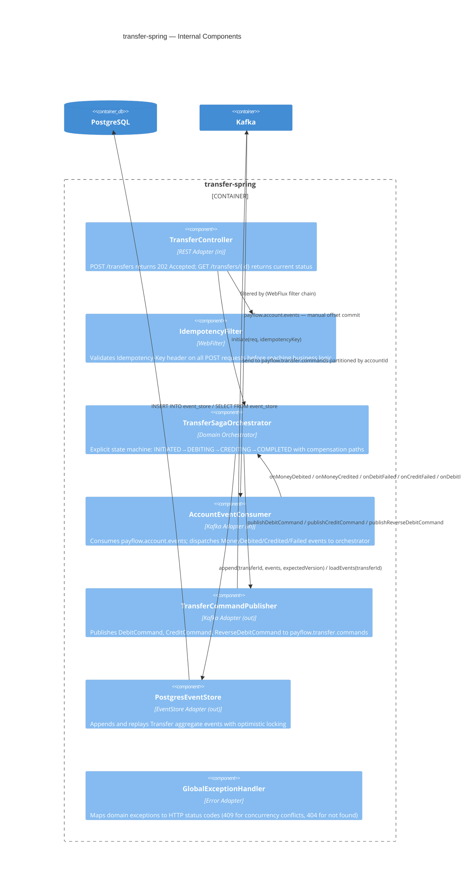

# C4 — Component Diagram: Transfer Service

```mermaid
C4Component
    title transfer-spring — Internal Components

    Container_Boundary(transfer, "transfer-spring") {
        Component(ctrl, "TransferController", "REST Adapter (in)", "POST /transfers returns 202 Accepted; GET /transfers/{id} returns current status")
        Component(filter, "IdempotencyFilter", "WebFilter", "Validates Idempotency-Key header on all POST requests before reaching business logic")
        Component(orchestrator, "TransferSagaOrchestrator", "Domain Orchestrator", "Explicit state machine: INITIATED→DEBITING→CREDITING→COMPLETED with compensation paths")
        Component(consumer, "AccountEventConsumer", "Kafka Adapter (in)", "Consumes payflow.account.events; dispatches MoneyDebited/Credited/Failed events to orchestrator")
        Component(publisher, "TransferCommandPublisher", "Kafka Adapter (out)", "Publishes DebitCommand, CreditCommand, ReverseDebitCommand to payflow.transfer.commands")
        Component(store, "PostgresEventStore", "EventStore Adapter (out)", "Appends and replays Transfer aggregate events with optimistic locking")
        Component(err, "GlobalExceptionHandler", "Error Adapter", "Maps domain exceptions to HTTP status codes (409 for concurrency conflicts, 404 for not found)")
    }

    ContainerDb(postgres, "PostgreSQL")
    Container(kafka, "Kafka")

    Rel(ctrl, filter, "filtered by (WebFlux filter chain)")
    Rel(ctrl, orchestrator, "initiate(req, idempotencyKey)")
    Rel(consumer, orchestrator, "onMoneyDebited / onMoneyCredited / onDebitFailed / onCreditFailed / onDebitReversed")
    Rel(orchestrator, publisher, "publishDebitCommand / publishCreditCommand / publishReverseDebitCommand")
    Rel(orchestrator, store, "append(transferId, events, expectedVersion) / loadEvents(transferId)")
    Rel(store, postgres, "INSERT INTO event_store / SELECT FROM event_store")
    Rel(publisher, kafka, "send to payflow.transfer.commands partitioned by accountId")
    Rel(kafka, consumer, "payflow.account.events — manual offset commit")
```
