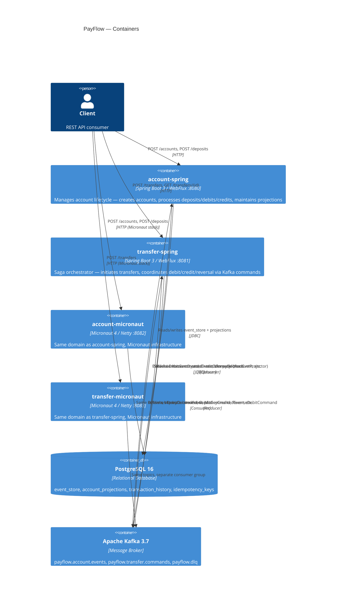

# C4 — Container Diagram

```mermaid
C4Container
    title PayFlow — Containers

    Person(user, "Client", "REST API consumer")

    Container(account_spring, "account-spring", "Spring Boot 3 / WebFlux :8080", "Manages account lifecycle — creates accounts, processes deposits/debits/credits, maintains projections")
    Container(transfer_spring, "transfer-spring", "Spring Boot 3 / WebFlux :8081", "Saga orchestrator — initiates transfers, coordinates debit/credit/reversal via Kafka commands")
    Container(account_mn, "account-micronaut", "Micronaut 4 / Netty :8082", "Same domain as account-spring, Micronaut infrastructure")
    Container(transfer_mn, "transfer-micronaut", "Micronaut 4 / Netty :8083", "Same domain as transfer-spring, Micronaut infrastructure")
    ContainerDb(postgres, "PostgreSQL 16", "Relational Database", "event_store, account_projections, transaction_history, idempotency_keys")
    Container(kafka, "Apache Kafka 3.7", "Message Broker", "payflow.account.events, payflow.transfer.commands, payflow.dlq")

    Rel(user, account_spring, "POST /accounts, POST /deposits", "HTTP")
    Rel(user, transfer_spring, "POST /transfers, GET /transfers/{id}", "HTTP")
    Rel(user, account_mn, "POST /accounts, POST /deposits", "HTTP (Micronaut stack)")
    Rel(user, transfer_mn, "POST /transfers", "HTTP (Micronaut stack)")
    Rel(account_spring, postgres, "Reads/writes event_store + projections", "JDBC")
    Rel(transfer_spring, postgres, "Reads/writes event_store + transfer projections", "JDBC")
    Rel(account_spring, kafka, "Publishes AccountCreatedEvent, MoneyDebitedEvent, etc.", "Producer")
    Rel(transfer_spring, kafka, "Publishes DebitCommand, CreditCommand, ReverseDebitCommand", "Producer")
    Rel(kafka, transfer_spring, "Delivers MoneyDebitedEvent, MoneyCreditedEvent, etc.", "Consumer")
    Rel(kafka, account_spring, "Delivers DebitCommand, CreditCommand (AccountProjector)", "Consumer")
    Rel(account_mn, postgres, "Same schema, separate connection pool")
    Rel(transfer_mn, kafka, "Same topics, separate consumer group")
```
