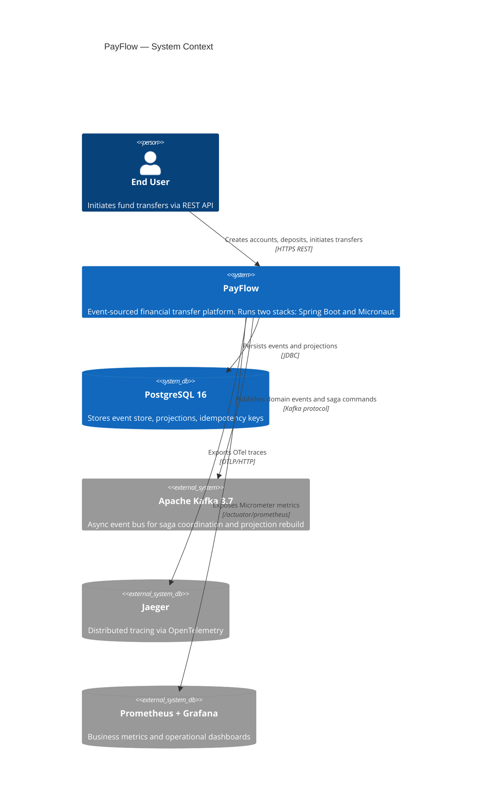

# C4 — System Context Diagram

```mermaid
C4Context
    title PayFlow — System Context

    Person(user, "End User", "Initiates fund transfers via REST API")
    System(payflow, "PayFlow", "Event-sourced financial transfer platform. Runs two stacks: Spring Boot and Micronaut")
    SystemDb(postgres, "PostgreSQL 16", "Stores event store, projections, idempotency keys")
    System_Ext(kafka, "Apache Kafka 3.7", "Async event bus for saga coordination and projection rebuild")
    SystemDb_Ext(jaeger, "Jaeger", "Distributed tracing via OpenTelemetry")
    SystemDb_Ext(prometheus, "Prometheus + Grafana", "Business metrics and operational dashboards")

    Rel(user, payflow, "Creates accounts, deposits, initiates transfers", "HTTPS REST")
    Rel(payflow, postgres, "Persists events and projections", "JDBC")
    Rel(payflow, kafka, "Publishes domain events and saga commands", "Kafka protocol")
    Rel(payflow, jaeger, "Exports OTel traces", "OTLP/HTTP")
    Rel(payflow, prometheus, "Exposes Micrometer metrics", "/actuator/prometheus")
```
