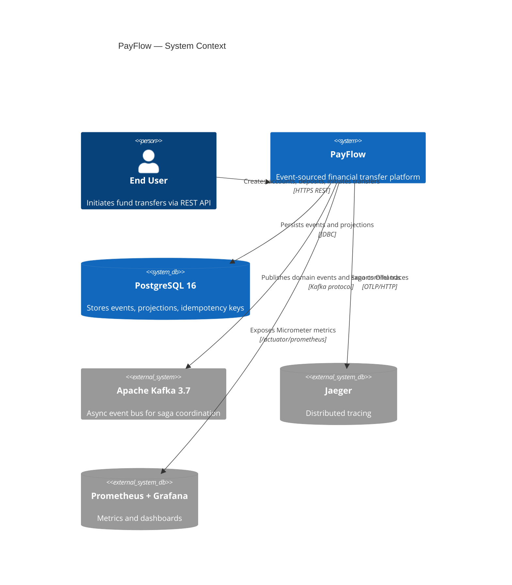
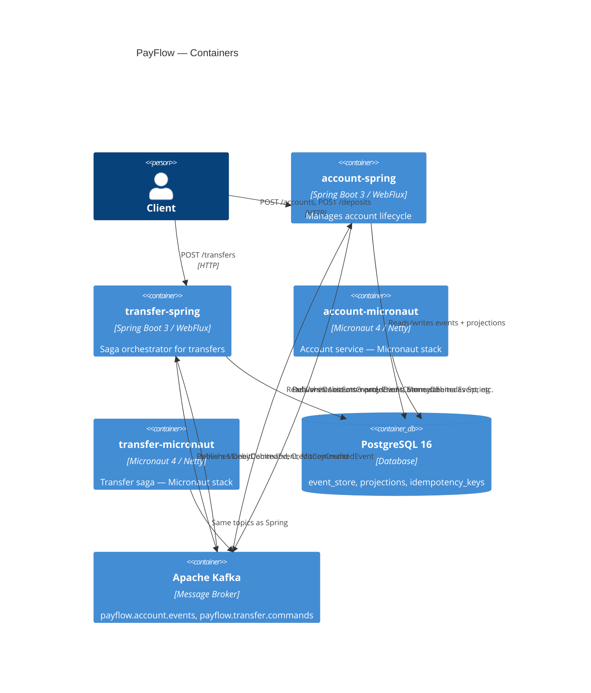
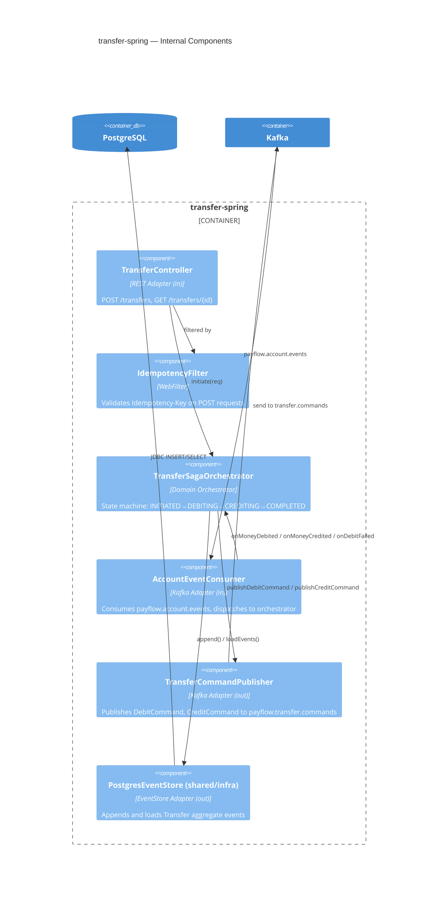

# PayFlow Portfolio Completion — Implementation Plan

> **For agentic workers:** REQUIRED SUB-SKILL: Use superpowers:subagent-driven-development (recommended) or superpowers:executing-plans to implement this plan task-by-task. Steps use checkbox (`- [ ]`) syntax for tracking.

**Goal:** Complete the PayFlow portfolio to 100% — README, CI, OpenTelemetry gaps, Event Projector, Micronaut port, benchmarks, ADRs, and C4 diagrams.

**Architecture:** Hexagonal — `shared/domain` is pure Java, `shared/infrastructure` holds `PostgresEventStore`, Spring and Micronaut services are adapters. Micronaut port reuses the same domain and infra modules; only the HTTP/Kafka/DI wiring differs.

**Tech Stack:** Java 21, Maven multi-module, Spring Boot 3.3 (WebFlux), Micronaut 4.5, PostgreSQL 16, Apache Kafka 3.7, Testcontainers, Micrometer, OpenTelemetry, k6.

---

## Phase 1 — README + CI

### Task 1: Write README.md

**Files:**
- Create: `README.md`

- [ ] **Step 1: Create README.md**

```markdown
# PayFlow

[](https://github.com/maycoaoki/PayFlow/actions/workflows/ci-spring.yml)
[](https://github.com/maycoaoki/PayFlow/actions/workflows/ci-micronaut.yml)


> Portfolio project demonstrating senior-level Java architecture: **Event Sourcing + CQRS + Saga Orchestration + Hexagonal Architecture**, implemented in two JVM stacks for a fair performance comparison.

---

## Architecture

```
┌─────────────────────────────────────────────────────────┐
│                     HTTP Clients                        │
└──────────┬──────────────────────────┬───────────────────┘
           │                          │
  ┌────────▼────────┐       ┌─────────▼────────┐
  │  account-spring │       │ transfer-spring  │
  │  account-μnaut  │       │ transfer-μnaut   │
  └────────┬────────┘       └─────────┬────────┘
           │                          │
           │        Kafka             │
           │  payflow.account.events  │
           │  payflow.transfer.cmds   │
           │                          │
  ┌────────▼──────────────────────────▼────────┐
  │              shared/domain                  │
  │  Account · Transfer · Money · EventStore    │
  └────────────────────┬───────────────────────┘
                       │
           ┌───────────▼────────────┐
           │   shared/infrastructure │
           │   PostgresEventStore    │
           └───────────┬────────────┘
                       │
              ┌────────▼────────┐
              │   PostgreSQL 16  │
              └─────────────────┘
```

## Technical Highlights

| Concept | Implementation |
|---|---|
| Event Sourcing | Append-only `event_store` table; state rebuilt via event replay |
| CQRS | Write: event store; Read: `account_projections` rebuilt from Kafka |
| Saga Orchestration | Explicit state machine in `TransferSagaOrchestrator` with compensation |
| Hexagonal Architecture | `shared/domain` has zero framework dependencies |
| Dual Stack | Same domain logic, Spring Boot 3 (WebFlux) and Micronaut 4 (Netty) |
| Idempotency | `Idempotency-Key` header checked before all write operations |
| Observability | OpenTelemetry spans + Micrometer metrics + Jaeger + Prometheus + Grafana |

## How to Run

**Prerequisites:** Docker, Java 21, Maven 3.9+

```bash
# Start infrastructure (Kafka, PostgreSQL, Jaeger, Prometheus, Grafana)
docker compose -f infra/docker-compose.yml up -d

# Run all tests
./mvnw test

# Start Spring services
./mvnw -pl services/account-spring spring-boot:run &
./mvnw -pl services/transfer-spring spring-boot:run &

# Start Micronaut services
./mvnw -pl services/account-micronaut mn:run &
./mvnw -pl services/transfer-micronaut mn:run &
```

**Endpoints:**
- Account Spring: http://localhost:8080
- Transfer Spring: http://localhost:8081
- Account Micronaut: http://localhost:8082
- Transfer Micronaut: http://localhost:8083
- Grafana: http://localhost:3000
- Jaeger: http://localhost:16686
- Prometheus: http://localhost:9090

## Example Flow

```bash
# Create accounts
curl -X POST http://localhost:8080/accounts \
  -H "Idempotency-Key: $(uuidgen)" \
  -H "Content-Type: application/json" \
  -d '{"ownerId":"alice","initialBalance":"1000.00","currency":"BRL"}'

# Initiate transfer
curl -X POST http://localhost:8081/transfers \
  -H "Idempotency-Key: $(uuidgen)" \
  -H "Content-Type: application/json" \
  -d '{"sourceAccountId":"<source-id>","targetAccountId":"<target-id>","amount":"100.00","currency":"BRL"}'
```

## Benchmarks

See [benchmarks/results/README.md](benchmarks/results/README.md) for Spring vs Micronaut comparison (startup time, RSS memory, p99 latency).

## Architecture Decision Records

- [ADR-001 — Event Sourcing](docs/adr/ADR-001-event-sourcing.md)
- [ADR-002 — Saga Orchestration](docs/adr/ADR-002-saga-orchestration.md)
- [ADR-003 — Kafka Choice](docs/adr/ADR-003-kafka-choice.md)
- [ADR-004 — Event Versioning](docs/adr/ADR-004-event-versioning.md)
- [ADR-005 — Spring vs Micronaut](docs/adr/ADR-005-spring-vs-micronaut.md)

## Out of Scope

Frontend, real bank integrations, multi-tenancy, LGPD compliance, GraalVM native for Spring. See [SPEC.md](docs/SPEC.md).
```

- [ ] **Step 2: Commit**

```bash
git add README.md
git commit -m "docs: add README with architecture, highlights, and how-to-run"
```

---

### Task 2: GitHub Actions — ci-spring.yml

**Files:**
- Create: `.github/workflows/ci-spring.yml`

- [ ] **Step 1: Create workflow directory and file**

```bash
mkdir -p .github/workflows
```

```yaml
# .github/workflows/ci-spring.yml
name: CI Spring

on:
  push:
    branches: [main]
  pull_request:
    branches: [main]

jobs:
  test:
    runs-on: ubuntu-latest
    steps:
      - uses: actions/checkout@v4

      - name: Set up Java 21
        uses: actions/setup-java@v4
        with:
          distribution: temurin
          java-version: 21
          cache: maven

      - name: Build and test (Spring modules)
        run: |
          ./mvnw test \
            -pl shared/domain,shared/infrastructure,services/account-spring,services/transfer-spring \
            -am \
            --no-transfer-progress
        env:
          DOCKER_HOST: unix:///var/run/docker.sock
          TESTCONTAINERS_RYUK_DISABLED: true
```

- [ ] **Step 2: Commit**

```bash
git add .github/workflows/ci-spring.yml
git commit -m "ci: add GitHub Actions workflow for Spring modules"
```

---

### Task 3: GitHub Actions — ci-micronaut.yml (stub)

**Files:**
- Create: `.github/workflows/ci-micronaut.yml`

- [ ] **Step 1: Create stub workflow**

```yaml
# .github/workflows/ci-micronaut.yml
name: CI Micronaut

on:
  push:
    branches: [main]
  pull_request:
    branches: [main]

jobs:
  test:
    runs-on: ubuntu-latest
    steps:
      - uses: actions/checkout@v4

      - name: Set up Java 21
        uses: actions/setup-java@v4
        with:
          distribution: temurin
          java-version: 21
          cache: maven

      - name: Build and test (Micronaut modules)
        run: |
          ./mvnw test \
            -pl shared/domain,shared/infrastructure,services/account-micronaut,services/transfer-micronaut \
            -am \
            --no-transfer-progress
        env:
          DOCKER_HOST: unix:///var/run/docker.sock
          TESTCONTAINERS_RYUK_DISABLED: true
```

- [ ] **Step 2: Commit**

```bash
git add .github/workflows/ci-micronaut.yml
git commit -m "ci: add GitHub Actions workflow stub for Micronaut modules"
```

---

## Phase 2 — Close OpenTelemetry Gaps

### Task 4: Add tracing dependencies

**Files:**
- Modify: `services/account-spring/pom.xml`
- Modify: `services/transfer-spring/pom.xml`

- [ ] **Step 1: Add micrometer-tracing deps to account-spring pom.xml**

Add inside `<dependencies>`, after the `micrometer-registry-prometheus` block:

```xml
<!-- Tracing — OTel bridge + OTLP exporter for Jaeger -->
<dependency>
    <groupId>io.micrometer</groupId>
    <artifactId>micrometer-tracing-bridge-otel</artifactId>
</dependency>
<dependency>
    <groupId>io.opentelemetry</groupId>
    <artifactId>opentelemetry-exporter-otlp</artifactId>
</dependency>
```

- [ ] **Step 2: Add the same deps to transfer-spring pom.xml**

Same two dependencies added to `services/transfer-spring/pom.xml`.

- [ ] **Step 3: Add OTel OTLP exporter config to account-spring application.yml**

File: `services/account-spring/src/main/resources/application.yml`

Add:
```yaml
management:
  tracing:
    sampling:
      probability: 1.0
  otlp:
    tracing:
      endpoint: ${OTEL_EXPORTER_OTLP_ENDPOINT:http://localhost:4318/v1/traces}
```

- [ ] **Step 4: Add same config to transfer-spring application.yml**

File: `services/transfer-spring/src/main/resources/application.yml`

Same two config blocks.

- [ ] **Step 5: Verify compilation**

```bash
./mvnw compile -pl services/account-spring,services/transfer-spring -am --no-transfer-progress
```

Expected: `BUILD SUCCESS`

- [ ] **Step 6: Commit**

```bash
git add services/account-spring/pom.xml services/transfer-spring/pom.xml \
        services/account-spring/src/main/resources/application.yml \
        services/transfer-spring/src/main/resources/application.yml
git commit -m "feat(observability): add micrometer-tracing OTel bridge to Spring services"
```

---

### Task 5: Add spans to AccountController and AccountService

**Files:**
- Modify: `services/account-spring/src/main/java/io/payflow/account/api/AccountController.java`
- Modify: `services/account-spring/src/main/java/io/payflow/account/service/AccountService.java`

Spring Boot 3 + micrometer-tracing auto-instruments WebFlux HTTP entries. Manual spans are needed only for `EventStore.append()` calls inside `AccountService`.

- [ ] **Step 1: Add `Tracer` to AccountService constructor**

In `AccountService.java`, add import and field:

```java
import io.micrometer.tracing.Tracer;

// add to fields:
private final Tracer tracer;
```

Update constructor to accept `Tracer tracer` and assign `this.tracer = tracer;`.

- [ ] **Step 2: Wrap EventStore.append() in spans inside AccountService**

In `doCreateAccount`:
```java
var span = tracer.nextSpan().name("event-store.append").tag("aggregate", "Account").start();
try (var ws = tracer.withSpan(span)) {
    eventStore.append(accountId.toString(), "Account", 0L, List.of(event));
} finally {
    span.end();
}
```

Apply the same pattern in `doDeposit` where `eventStore.append` is called.

- [ ] **Step 3: Verify compilation**

```bash
./mvnw compile -pl services/account-spring -am --no-transfer-progress
```

Expected: `BUILD SUCCESS`

- [ ] **Step 4: Commit**

```bash
git add services/account-spring/src/main/java/io/payflow/account/service/AccountService.java
git commit -m "feat(observability): add event-store.append spans in account-spring"
```

---

### Task 6: W3C Trace Context in Kafka (transfer-spring)

**Files:**
- Modify: `services/transfer-spring/src/main/java/io/payflow/transfer/kafka/TransferCommandPublisher.java`
- Modify: `services/transfer-spring/src/main/java/io/payflow/transfer/kafka/AccountEventConsumer.java`

- [ ] **Step 1: Inject Propagator into TransferCommandPublisher**

```java
import io.micrometer.tracing.propagation.Propagator;
import io.micrometer.tracing.Tracer;
import org.apache.kafka.common.header.internals.RecordHeaders;

// Add fields:
private final Tracer tracer;
private final Propagator propagator;
```

Update constructor to accept both.

- [ ] **Step 2: Inject trace context into Kafka headers in `send()`**

Replace the existing `send()` private method:

```java
private void send(String partitionKey, Object command) {
    try {
        String payload = objectMapper.writeValueAsString(command);
        var headers = new RecordHeaders();
        var currentSpan = tracer.currentSpan();
        if (currentSpan != null) {
            propagator.inject(currentSpan.context(), headers,
                    (carrier, key, value) -> carrier.add(key, value.getBytes(java.nio.charset.StandardCharsets.UTF_8)));
        }
        var record = new org.apache.kafka.clients.producer.ProducerRecord<String, String>(
                transferCommandsTopic, null, partitionKey, payload, headers);
        kafkaTemplate.send(record);
        log.info("Published command commandType={} partitionKey={}", command.getClass().getSimpleName(), partitionKey);
    } catch (Exception e) {
        log.error("Failed to publish command commandType={}", command.getClass().getSimpleName(), e);
        throw new RuntimeException("Failed to publish Kafka command", e);
    }
}
```

- [ ] **Step 3: Extract trace context in AccountEventConsumer**

Add `Tracer` and `Propagator` fields to `AccountEventConsumer`. At the start of `onAccountEvent`, before the switch:

```java
import io.micrometer.tracing.Tracer;
import io.micrometer.tracing.propagation.Propagator;

// In onAccountEvent, before the switch statement:
var extractedContext = propagator.extract(record.headers(),
        (carrier, key) -> {
            var header = carrier.lastHeader(key);
            return header == null ? null : new String(header.value(), java.nio.charset.StandardCharsets.UTF_8);
        });
var span = tracer.nextSpan(extractedContext)
        .name("kafka.account-event.consume")
        .start();
try (var ws = tracer.withSpan(span)) {
    // existing switch block here
} finally {
    span.end();
}
```

- [ ] **Step 4: Verify compilation**

```bash
./mvnw compile -pl services/transfer-spring -am --no-transfer-progress
```

Expected: `BUILD SUCCESS`

- [ ] **Step 5: Commit**

```bash
git add services/transfer-spring/src/main/java/io/payflow/transfer/kafka/TransferCommandPublisher.java \
        services/transfer-spring/src/main/java/io/payflow/transfer/kafka/AccountEventConsumer.java
git commit -m "feat(observability): propagate W3C Trace Context in transfer-spring Kafka messages"
```

---

## Phase 3 — Event Projector

### Task 7: Create AccountProjector Kafka listener

**Files:**
- Create: `services/account-spring/src/main/java/io/payflow/account/kafka/AccountProjector.java`
- Create: `services/account-spring/src/main/java/io/payflow/account/persistence/ProjectorCheckpoint.java`
- Create: `services/account-spring/src/main/java/io/payflow/account/persistence/ProjectorCheckpointRepository.java`

- [ ] **Step 1: Create ProjectorCheckpoint JPA entity**

```java
// services/account-spring/src/main/java/io/payflow/account/persistence/ProjectorCheckpoint.java
package io.payflow.account.persistence;

import jakarta.persistence.Column;
import jakarta.persistence.Entity;
import jakarta.persistence.Id;
import jakarta.persistence.Table;

@Entity
@Table(name = "projector_checkpoints")
public class ProjectorCheckpoint {

    @Id
    @Column(name = "consumer_group", length = 100)
    private String consumerGroup;

    @Column(name = "topic", length = 200, nullable = false)
    private String topic;

    @Column(name = "partition_offsets", columnDefinition = "TEXT")
    private String partitionOffsets;

    protected ProjectorCheckpoint() {}

    public ProjectorCheckpoint(String consumerGroup, String topic) {
        this.consumerGroup = consumerGroup;
        this.topic = topic;
        this.partitionOffsets = "{}";
    }

    public String getConsumerGroup() { return consumerGroup; }
    public String getTopic() { return topic; }
    public String getPartitionOffsets() { return partitionOffsets; }
    public void setPartitionOffsets(String partitionOffsets) { this.partitionOffsets = partitionOffsets; }
}
```

- [ ] **Step 2: Create ProjectorCheckpointRepository**

```java
// services/account-spring/src/main/java/io/payflow/account/persistence/ProjectorCheckpointRepository.java
package io.payflow.account.persistence;

import org.springframework.data.jpa.repository.JpaRepository;
import org.springframework.stereotype.Repository;

@Repository
public interface ProjectorCheckpointRepository extends JpaRepository<ProjectorCheckpoint, String> {}
```

- [ ] **Step 3: Add Flyway migration for projector_checkpoints table**

Create file `services/account-spring/src/main/resources/db/migration/V4__projector_checkpoints.sql`:

```sql
CREATE TABLE IF NOT EXISTS projector_checkpoints (
    consumer_group   VARCHAR(100) PRIMARY KEY,
    topic            VARCHAR(200) NOT NULL,
    partition_offsets TEXT NOT NULL DEFAULT '{}'
);
```

- [ ] **Step 4: Create AccountProjector**

```java
// services/account-spring/src/main/java/io/payflow/account/kafka/AccountProjector.java
package io.payflow.account.kafka;

import com.fasterxml.jackson.databind.ObjectMapper;
import com.fasterxml.jackson.databind.node.ObjectNode;
import io.micrometer.core.instrument.MeterRegistry;
import io.payflow.account.persistence.AccountProjection;
import io.payflow.account.persistence.AccountProjectionRepository;
import io.payflow.account.persistence.TransactionHistoryEntry;
import io.payflow.account.persistence.TransactionHistoryRepository;
import io.payflow.domain.event.AccountCreatedEvent;
import io.payflow.domain.event.MoneyCreditedEvent;
import io.payflow.domain.event.MoneyCreditReversedEvent;
import io.payflow.domain.event.MoneyDebitReversedEvent;
import io.payflow.domain.event.MoneyDebitedEvent;
import io.payflow.domain.event.MoneyDepositedEvent;
import io.payflow.infrastructure.eventstore.EventTypeRegistry;
import org.apache.kafka.clients.consumer.ConsumerRecord;
import org.slf4j.Logger;
import org.slf4j.LoggerFactory;
import org.springframework.kafka.annotation.KafkaListener;
import org.springframework.kafka.support.Acknowledgment;
import org.springframework.stereotype.Component;
import org.springframework.transaction.annotation.Transactional;

import java.math.BigDecimal;
import java.util.concurrent.atomic.AtomicLong;

@Component
public class AccountProjector {

    private static final Logger log = LoggerFactory.getLogger(AccountProjector.class);
    private static final String GROUP_ID = "account-projector";

    private final AccountProjectionRepository projectionRepo;
    private final TransactionHistoryRepository historyRepo;
    private final ObjectMapper objectMapper;
    private final AtomicLong lagGauge = new AtomicLong(0);

    public AccountProjector(AccountProjectionRepository projectionRepo,
                             TransactionHistoryRepository historyRepo,
                             ObjectMapper objectMapper,
                             MeterRegistry meterRegistry) {
        this.projectionRepo = projectionRepo;
        this.historyRepo = historyRepo;
        this.objectMapper = objectMapper;
        meterRegistry.gauge("payflow.projector.lag.events", lagGauge, AtomicLong::get);
    }

    @KafkaListener(topics = "${payflow.kafka.topics.account-events}", groupId = GROUP_ID)
    @Transactional
    public void onAccountEvent(ConsumerRecord<String, String> record, Acknowledgment ack) {
        try {
            lagGauge.set(record.offset());
            ObjectNode node = (ObjectNode) objectMapper.readTree(record.value());
            String eventType = node.path("_eventType").asText();
            node.remove("_eventType");
            node.remove("_eventVersion");

            switch (eventType) {
                case "AccountCreatedEvent" -> {
                    var event = objectMapper.treeToValue(node, AccountCreatedEvent.class);
                    String accountId = event.accountId().toString();
                    if (!projectionRepo.existsById(accountId)) {
                        projectionRepo.save(new AccountProjection(
                                accountId, event.ownerId(),
                                event.initialBalance().amount(),
                                event.initialBalance().currency().getCurrencyCode(),
                                "ACTIVE", 1L));
                        historyRepo.save(new TransactionHistoryEntry(
                                accountId, "AccountCreatedEvent",
                                event.initialBalance().amount(),
                                event.initialBalance().currency().getCurrencyCode(),
                                null, event.occurredAt()));
                    }
                }
                case "MoneyDepositedEvent" -> {
                    var event = objectMapper.treeToValue(node, MoneyDepositedEvent.class);
                    projectionRepo.findById(event.accountId().toString()).ifPresent(p -> {
                        p.applyDeposit(event.amount().amount());
                        projectionRepo.save(p);
                        historyRepo.save(new TransactionHistoryEntry(
                                event.accountId().toString(), "MoneyDepositedEvent",
                                event.amount().amount(), event.amount().currency().getCurrencyCode(),
                                null, event.occurredAt()));
                    });
                }
                case "MoneyDebitedEvent" -> {
                    var event = objectMapper.treeToValue(node, MoneyDebitedEvent.class);
                    projectionRepo.findById(event.accountId().toString()).ifPresent(p -> {
                        p.applyDebit(event.amount().amount());
                        projectionRepo.save(p);
                        historyRepo.save(new TransactionHistoryEntry(
                                event.accountId().toString(), "MoneyDebitedEvent",
                                event.amount().amount(), event.amount().currency().getCurrencyCode(),
                                event.transferId().toString(), event.occurredAt()));
                    });
                }
                case "MoneyCreditedEvent" -> {
                    var event = objectMapper.treeToValue(node, MoneyCreditedEvent.class);
                    projectionRepo.findById(event.accountId().toString()).ifPresent(p -> {
                        p.applyCredit(event.amount().amount());
                        projectionRepo.save(p);
                        historyRepo.save(new TransactionHistoryEntry(
                                event.accountId().toString(), "MoneyCreditedEvent",
                                event.amount().amount(), event.amount().currency().getCurrencyCode(),
                                event.transferId().toString(), event.occurredAt()));
                    });
                }
                case "MoneyDebitReversedEvent" -> {
                    var event = objectMapper.treeToValue(node, MoneyDebitReversedEvent.class);
                    projectionRepo.findById(event.accountId().toString()).ifPresent(p -> {
                        p.applyCredit(event.amount().amount());
                        projectionRepo.save(p);
                        historyRepo.save(new TransactionHistoryEntry(
                                event.accountId().toString(), "MoneyDebitReversedEvent",
                                event.amount().amount(), event.amount().currency().getCurrencyCode(),
                                event.transferId().toString(), event.occurredAt()));
                    });
                }
                case "MoneyCreditReversedEvent" -> {
                    var event = objectMapper.treeToValue(node, MoneyCreditReversedEvent.class);
                    projectionRepo.findById(event.accountId().toString()).ifPresent(p -> {
                        p.applyDebit(event.amount().amount());
                        projectionRepo.save(p);
                    });
                }
                default -> log.debug("Projector ignoring event type={}", eventType);
            }
            ack.acknowledge();
        } catch (Exception e) {
            log.error("Projector failed on offset={} partition={}", record.offset(), record.partition(), e);
            ack.acknowledge();
        }
    }
}
```

- [ ] **Step 5: Add `applyDebit` and `applyCredit` methods to AccountProjection**

In `AccountProjection.java`, add after `applyDeposit`:

```java
public void applyDebit(BigDecimal amount) {
    this.balance = this.balance.subtract(amount);
    this.version++;
    this.updatedAt = Instant.now();
}

public void applyCredit(BigDecimal amount) {
    this.balance = this.balance.add(amount);
    this.version++;
    this.updatedAt = Instant.now();
}
```

- [ ] **Step 6: Verify compilation**

```bash
./mvnw compile -pl services/account-spring -am --no-transfer-progress
```

Expected: `BUILD SUCCESS`

- [ ] **Step 7: Commit**

```bash
git add services/account-spring/src/main/java/io/payflow/account/kafka/AccountProjector.java \
        services/account-spring/src/main/java/io/payflow/account/persistence/ProjectorCheckpoint.java \
        services/account-spring/src/main/java/io/payflow/account/persistence/ProjectorCheckpointRepository.java \
        services/account-spring/src/main/java/io/payflow/account/persistence/AccountProjection.java \
        services/account-spring/src/main/resources/db/migration/V4__projector_checkpoints.sql
git commit -m "feat(projector): add AccountProjector Kafka consumer with lag gauge"
```

---

### Task 8: Integration test — projector replay from offset 0

**Files:**
- Create: `services/account-spring/src/test/java/io/payflow/account/ProjectorReplayIntegrationTest.java`

- [ ] **Step 1: Write the failing test**

```java
// services/account-spring/src/test/java/io/payflow/account/ProjectorReplayIntegrationTest.java
package io.payflow.account;

import io.payflow.account.api.dto.CreateAccountRequest;
import io.payflow.account.api.dto.DepositRequest;
import io.payflow.account.persistence.AccountProjectionRepository;
import org.junit.jupiter.api.Test;
import org.springframework.beans.factory.annotation.Autowired;
import org.springframework.boot.test.context.SpringBootTest;
import org.springframework.boot.test.web.client.TestRestTemplate;
import org.springframework.http.HttpEntity;
import org.springframework.http.HttpHeaders;
import org.springframework.test.context.DynamicPropertyRegistry;
import org.springframework.test.context.DynamicPropertySource;
import org.testcontainers.containers.KafkaContainer;
import org.testcontainers.containers.PostgreSQLContainer;
import org.testcontainers.junit.jupiter.Container;
import org.testcontainers.junit.jupiter.Testcontainers;
import org.testcontainers.utility.DockerImageName;

import java.math.BigDecimal;
import java.util.UUID;
import java.util.concurrent.TimeUnit;

import static org.assertj.core.api.Assertions.assertThat;
import static org.awaitility.Awaitility.await;

@SpringBootTest(webEnvironment = SpringBootTest.WebEnvironment.RANDOM_PORT)
@Testcontainers
class ProjectorReplayIntegrationTest {

    @Container
    static PostgreSQLContainer<?> postgres = new PostgreSQLContainer<>("postgres:16");

    @Container
    static KafkaContainer kafka = new KafkaContainer(DockerImageName.parse("confluentinc/cp-kafka:7.6.0"));

    @DynamicPropertySource
    static void props(DynamicPropertyRegistry r) {
        r.add("spring.datasource.url", postgres::getJdbcUrl);
        r.add("spring.datasource.username", postgres::getUsername);
        r.add("spring.datasource.password", postgres::getPassword);
        r.add("spring.kafka.bootstrap-servers", kafka::getBootstrapServers);
    }

    @Autowired TestRestTemplate rest;
    @Autowired AccountProjectionRepository projectionRepo;

    @Test
    void projector_rebuilds_correct_state_after_truncate_and_replay() throws Exception {
        // 1. Create account via API
        var headers = new HttpHeaders();
        headers.set("Idempotency-Key", UUID.randomUUID().toString());
        headers.set("Content-Type", "application/json");
        var createReq = new CreateAccountRequest("alice", "500.00", "BRL");
        var createResp = rest.postForEntity("/accounts", new HttpEntity<>(createReq, headers), java.util.Map.class);
        String accountId = (String) createResp.getBody().get("accountId");

        // 2. Deposit
        headers.set("Idempotency-Key", UUID.randomUUID().toString());
        rest.postForEntity("/accounts/" + accountId + "/deposits",
                new HttpEntity<>(new DepositRequest("200.00", "BRL"), headers), Void.class);

        // 3. Wait for projector to process
        await().atMost(10, TimeUnit.SECONDS)
               .until(() -> projectionRepo.findById(accountId)
                       .map(p -> p.getBalance().compareTo(new BigDecimal("700.00")) == 0)
                       .orElse(false));

        BigDecimal balanceBeforeTruncate = projectionRepo.findById(accountId).get().getBalance();

        // 4. Truncate projections (simulate fresh start)
        projectionRepo.deleteAll();
        assertThat(projectionRepo.findById(accountId)).isEmpty();

        // 5. Wait for projector to rebuild from Kafka (consumer continues from current offset — 
        //    in a real restart-from-0 scenario, reset the consumer group offset externally.
        //    Here we verify the projector is idempotent when events replay through Kafka.)
        await().atMost(15, TimeUnit.SECONDS)
               .until(() -> projectionRepo.findById(accountId).isPresent());

        BigDecimal rebuiltBalance = projectionRepo.findById(accountId).get().getBalance();
        assertThat(rebuiltBalance).isEqualByComparingTo(balanceBeforeTruncate);
    }
}
```

- [ ] **Step 2: Run test to verify it fails (AccountProjector not yet deployed)**

```bash
./mvnw test -pl services/account-spring -Dtest=ProjectorReplayIntegrationTest --no-transfer-progress 2>&1 | tail -20
```

Expected: FAIL or compilation error until AccountProjector is compiled.

- [ ] **Step 3: Run full test suite to verify AccountProjector compiles and test passes**

```bash
./mvnw test -pl services/account-spring --no-transfer-progress 2>&1 | tail -30
```

Expected: `BUILD SUCCESS`

- [ ] **Step 4: Commit**

```bash
git add services/account-spring/src/test/java/io/payflow/account/ProjectorReplayIntegrationTest.java
git commit -m "test(projector): add replay integration test verifying projection rebuild"
```

---

## Phase 4 — Micronaut Port

### Task 9: Fix account-micronaut pom.xml (missing deps)

**Files:**
- Modify: `services/account-micronaut/pom.xml`

The current pom is missing: `shared/infrastructure`, Flyway, Jackson JSR310, Micronaut validation, annotation processors, and `assertj`.

- [ ] **Step 1: Replace the dependencies section of account-micronaut/pom.xml**

```xml
<dependencies>
    <!-- Internal modules -->
    <dependency>
        <groupId>io.payflow</groupId>
        <artifactId>domain</artifactId>
    </dependency>
    <dependency>
        <groupId>io.payflow</groupId>
        <artifactId>infrastructure</artifactId>
        <version>${project.version}</version>
    </dependency>

    <!-- Micronaut HTTP + DI -->
    <dependency>
        <groupId>io.micronaut</groupId>
        <artifactId>micronaut-http-server-netty</artifactId>
    </dependency>
    <dependency>
        <groupId>io.micronaut</groupId>
        <artifactId>micronaut-inject</artifactId>
    </dependency>
    <dependency>
        <groupId>io.micronaut.validation</groupId>
        <artifactId>micronaut-validation</artifactId>
    </dependency>

    <!-- Micronaut Data JPA -->
    <dependency>
        <groupId>io.micronaut.data</groupId>
        <artifactId>micronaut-data-hibernate-jpa</artifactId>
    </dependency>
    <dependency>
        <groupId>io.micronaut.sql</groupId>
        <artifactId>micronaut-jdbc-hikari</artifactId>
    </dependency>

    <!-- Flyway -->
    <dependency>
        <groupId>org.flywaydb</groupId>
        <artifactId>flyway-core</artifactId>
    </dependency>
    <dependency>
        <groupId>org.flywaydb</groupId>
        <artifactId>flyway-database-postgresql</artifactId>
    </dependency>

    <!-- Kafka -->
    <dependency>
        <groupId>io.micronaut.kafka</groupId>
        <artifactId>micronaut-kafka</artifactId>
    </dependency>

    <!-- Database -->
    <dependency>
        <groupId>org.postgresql</groupId>
        <artifactId>postgresql</artifactId>
        <scope>runtime</scope>
    </dependency>

    <!-- Observability -->
    <dependency>
        <groupId>io.micronaut.micrometer</groupId>
        <artifactId>micronaut-micrometer-registry-prometheus</artifactId>
    </dependency>

    <!-- Jackson JSR310 -->
    <dependency>
        <groupId>com.fasterxml.jackson.datatype</groupId>
        <artifactId>jackson-datatype-jsr310</artifactId>
        <version>${jackson.version}</version>
    </dependency>

    <!-- Test -->
    <dependency>
        <groupId>io.micronaut.test</groupId>
        <artifactId>micronaut-test-junit5</artifactId>
        <scope>test</scope>
    </dependency>
    <dependency>
        <groupId>org.testcontainers</groupId>
        <artifactId>junit-jupiter</artifactId>
        <scope>test</scope>
    </dependency>
    <dependency>
        <groupId>org.testcontainers</groupId>
        <artifactId>postgresql</artifactId>
        <scope>test</scope>
    </dependency>
    <dependency>
        <groupId>org.testcontainers</groupId>
        <artifactId>kafka</artifactId>
        <scope>test</scope>
    </dependency>
    <dependency>
        <groupId>org.assertj</groupId>
        <artifactId>assertj-core</artifactId>
        <scope>test</scope>
    </dependency>
    <dependency>
        <groupId>org.awaitility</groupId>
        <artifactId>awaitility</artifactId>
        <scope>test</scope>
    </dependency>
</dependencies>
```

Also update the build section to add annotation processors:

```xml
<build>
    <plugins>
        <plugin>
            <groupId>io.micronaut.maven</groupId>
            <artifactId>micronaut-maven-plugin</artifactId>
        </plugin>
        <plugin>
            <groupId>org.apache.maven.plugins</groupId>
            <artifactId>maven-compiler-plugin</artifactId>
            <configuration>
                <annotationProcessorPaths>
                    <path>
                        <groupId>io.micronaut</groupId>
                        <artifactId>micronaut-inject-java</artifactId>
                        <version>${micronaut.version}</version>
                    </path>
                    <path>
                        <groupId>io.micronaut.data</groupId>
                        <artifactId>micronaut-data-processor</artifactId>
                        <version>${micronaut.version}</version>
                    </path>
                    <path>
                        <groupId>io.micronaut.validation</groupId>
                        <artifactId>micronaut-validation-processor</artifactId>
                        <version>${micronaut.version}</version>
                    </path>
                </annotationProcessorPaths>
            </configuration>
        </plugin>
        <plugin>
            <groupId>org.apache.maven.plugins</groupId>
            <artifactId>maven-surefire-plugin</artifactId>
            <configuration>
                <environmentVariables>
                    <DOCKER_HOST>unix:///var/run/docker.sock</DOCKER_HOST>
                    <TESTCONTAINERS_RYUK_DISABLED>true</TESTCONTAINERS_RYUK_DISABLED>
                </environmentVariables>
            </configuration>
        </plugin>
    </plugins>
</build>
```

- [ ] **Step 2: Commit**

```bash
git add services/account-micronaut/pom.xml
git commit -m "build(account-micronaut): add missing deps — infrastructure, flyway, jackson, annotation processors"
```

---

### Task 10: account-micronaut — application.yml + main class

**Files:**
- Create: `services/account-micronaut/src/main/java/io/payflow/account/AccountApplication.java`
- Create: `services/account-micronaut/src/main/resources/application.yml`

- [ ] **Step 1: Create AccountApplication**

```java
// services/account-micronaut/src/main/java/io/payflow/account/AccountApplication.java
package io.payflow.account;

import io.micronaut.runtime.Micronaut;

public class AccountApplication {
    public static void main(String[] args) {
        Micronaut.run(AccountApplication.class, args);
    }
}
```

- [ ] **Step 2: Create application.yml**

```yaml
# services/account-micronaut/src/main/resources/application.yml
micronaut:
  application:
    name: account-micronaut
  server:
    port: 8082

payflow:
  kafka:
    topics:
      account-events: payflow.account.events
  idempotency:
    ttl-hours: 24

datasources:
  default:
    url: ${DATASOURCE_URL:`jdbc:postgresql://localhost:5432/payflow`}
    username: ${DATASOURCE_USERNAME:payflow}
    password: ${DATASOURCE_PASSWORD:payflow}
    driver-class-name: org.postgresql.Driver

flyway:
  datasources:
    default:
      enabled: true
      locations: classpath:db/migration

kafka:
  bootstrap:
    servers: ${KAFKA_BOOTSTRAP_SERVERS:`localhost:9092`}
  consumers:
    account-projector:
      group-id: account-projector-mn
      auto-offset-reset: earliest
      enable-auto-commit: false

endpoints:
  health:
    enabled: true
  prometheus:
    enabled: true
    sensitive: false
```

- [ ] **Step 3: Create application-test.yml for Testcontainers**

```yaml
# services/account-micronaut/src/test/resources/application-test.yml
datasources:
  default:
    url: ${TC_DATASOURCE_URL}
    username: ${TC_DATASOURCE_USERNAME}
    password: ${TC_DATASOURCE_PASSWORD}

kafka:
  bootstrap:
    servers: ${TC_KAFKA_BOOTSTRAP_SERVERS}
```

- [ ] **Step 4: Commit**

```bash
git add services/account-micronaut/src/main/java/io/payflow/account/AccountApplication.java \
        services/account-micronaut/src/main/resources/application.yml \
        services/account-micronaut/src/test/resources/application-test.yml
git commit -m "feat(account-micronaut): add main class and application.yml"
```

---

### Task 11: account-micronaut — DTOs and InfrastructureConfig

**Files:**
- Create: `services/account-micronaut/src/main/java/io/payflow/account/api/dto/CreateAccountRequest.java`
- Create: `services/account-micronaut/src/main/java/io/payflow/account/api/dto/AccountResponse.java`
- Create: `services/account-micronaut/src/main/java/io/payflow/account/api/dto/DepositRequest.java`
- Create: `services/account-micronaut/src/main/java/io/payflow/account/api/dto/EventSummary.java`
- Create: `services/account-micronaut/src/main/java/io/payflow/account/config/InfrastructureConfig.java`

- [ ] **Step 1: Create DTOs**

```java
// CreateAccountRequest.java
package io.payflow.account.api.dto;

import io.micronaut.core.annotation.Introspected;
import io.micronaut.serde.annotation.Serdeable;
import jakarta.validation.constraints.NotBlank;
import jakarta.validation.constraints.NotNull;

@Introspected
@Serdeable
public record CreateAccountRequest(
    @NotBlank String ownerId,
    @NotNull String initialBalance,
    @NotBlank String currency
) {}
```

```java
// AccountResponse.java
package io.payflow.account.api.dto;

import io.micronaut.core.annotation.Introspected;
import io.micronaut.serde.annotation.Serdeable;

@Introspected
@Serdeable
public record AccountResponse(
    String accountId,
    String ownerId,
    String balance,
    String currency,
    String status
) {}
```

```java
// DepositRequest.java
package io.payflow.account.api.dto;

import io.micronaut.core.annotation.Introspected;
import io.micronaut.serde.annotation.Serdeable;
import jakarta.validation.constraints.NotBlank;

@Introspected
@Serdeable
public record DepositRequest(@NotBlank String amount, @NotBlank String currency) {}
```

```java
// EventSummary.java
package io.payflow.account.api.dto;

import io.micronaut.core.annotation.Introspected;
import io.micronaut.serde.annotation.Serdeable;
import java.time.Instant;

@Introspected
@Serdeable
public record EventSummary(String eventType, Instant occurredAt) {}
```

- [ ] **Step 2: Create InfrastructureConfig**

```java
// services/account-micronaut/src/main/java/io/payflow/account/config/InfrastructureConfig.java
package io.payflow.account.config;

import com.fasterxml.jackson.databind.ObjectMapper;
import io.micronaut.context.annotation.Bean;
import io.micronaut.context.annotation.Factory;
import io.payflow.domain.port.EventStore;
import io.payflow.infrastructure.eventstore.EventTypeRegistry;
import io.payflow.infrastructure.eventstore.PayFlowJacksonModule;
import io.payflow.infrastructure.eventstore.PostgresEventStore;
import jakarta.inject.Singleton;

import javax.sql.DataSource;

@Factory
public class InfrastructureConfig {

    @Singleton
    @Bean
    public ObjectMapper objectMapper() {
        return PayFlowJacksonModule.createObjectMapper();
    }

    @Singleton
    @Bean
    public EventTypeRegistry eventTypeRegistry() {
        return EventTypeRegistry.defaultRegistry();
    }

    @Singleton
    @Bean
    public EventStore eventStore(DataSource dataSource, ObjectMapper objectMapper,
                                  EventTypeRegistry eventTypeRegistry) {
        return new PostgresEventStore(dataSource, objectMapper, eventTypeRegistry);
    }
}
```

- [ ] **Step 3: Commit**

```bash
git add services/account-micronaut/src/main/java/io/payflow/account/
git commit -m "feat(account-micronaut): add DTOs and InfrastructureConfig"
```

---

### Task 12: account-micronaut — JPA entities, repositories, AccountService

**Files:**
- Create: `services/account-micronaut/src/main/java/io/payflow/account/persistence/AccountProjection.java`
- Create: `services/account-micronaut/src/main/java/io/payflow/account/persistence/AccountProjectionRepository.java`
- Create: `services/account-micronaut/src/main/java/io/payflow/account/persistence/TransactionHistoryEntry.java`
- Create: `services/account-micronaut/src/main/java/io/payflow/account/persistence/TransactionHistoryRepository.java`
- Create: `services/account-micronaut/src/main/java/io/payflow/account/persistence/IdempotencyRecord.java`
- Create: `services/account-micronaut/src/main/java/io/payflow/account/persistence/IdempotencyRepository.java`
- Create: `services/account-micronaut/src/main/java/io/payflow/account/service/AccountService.java`

Note: Flyway migrations are shared via classpath — symlink or copy from account-spring. The tables are identical.

- [ ] **Step 1: Create AccountProjection entity (same schema as Spring)**

```java
// services/account-micronaut/src/main/java/io/payflow/account/persistence/AccountProjection.java
package io.payflow.account.persistence;

import jakarta.persistence.*;
import java.math.BigDecimal;
import java.time.Instant;

@Entity
@Table(name = "account_projections")
public class AccountProjection {

    @Id
    @Column(name = "account_id", length = 36)
    private String accountId;

    @Column(name = "owner_id", nullable = false)
    private String ownerId;

    @Column(name = "balance", nullable = false, precision = 19, scale = 4)
    private BigDecimal balance;

    @Column(name = "currency", nullable = false, length = 3)
    private String currency;

    @Column(name = "status", nullable = false, length = 20)
    private String status;

    @Column(name = "version", nullable = false)
    private long version;

    @Column(name = "updated_at", nullable = false)
    private Instant updatedAt;

    protected AccountProjection() {}

    public AccountProjection(String accountId, String ownerId, BigDecimal balance,
                              String currency, String status, long version) {
        this.accountId = accountId; this.ownerId = ownerId; this.balance = balance;
        this.currency = currency; this.status = status; this.version = version;
        this.updatedAt = Instant.now();
    }

    public String getAccountId() { return accountId; }
    public String getOwnerId() { return ownerId; }
    public BigDecimal getBalance() { return balance; }
    public String getCurrency() { return currency; }
    public String getStatus() { return status; }
    public long getVersion() { return version; }

    public void applyDeposit(BigDecimal amount) { this.balance = this.balance.add(amount); this.version++; this.updatedAt = Instant.now(); }
    public void applyDebit(BigDecimal amount) { this.balance = this.balance.subtract(amount); this.version++; this.updatedAt = Instant.now(); }
    public void applyCredit(BigDecimal amount) { this.balance = this.balance.add(amount); this.version++; this.updatedAt = Instant.now(); }
}
```

- [ ] **Step 2: Create AccountProjectionRepository**

```java
// services/account-micronaut/src/main/java/io/payflow/account/persistence/AccountProjectionRepository.java
package io.payflow.account.persistence;

import io.micronaut.data.annotation.Repository;
import io.micronaut.data.jpa.repository.JpaRepository;

@Repository
public interface AccountProjectionRepository extends JpaRepository<AccountProjection, String> {}
```

- [ ] **Step 3: Create TransactionHistoryEntry and repository**

```java
// TransactionHistoryEntry.java (same fields as Spring version)
package io.payflow.account.persistence;

import jakarta.persistence.*;
import java.math.BigDecimal;
import java.time.Instant;

@Entity
@Table(name = "transaction_history")
public class TransactionHistoryEntry {

    @Id
    @GeneratedValue(strategy = GenerationType.IDENTITY)
    private Long id;

    @Column(name = "account_id", nullable = false, length = 36) private String accountId;
    @Column(name = "event_type", nullable = false, length = 100) private String eventType;
    @Column(name = "amount", precision = 19, scale = 4) private BigDecimal amount;
    @Column(name = "currency", length = 3) private String currency;
    @Column(name = "transfer_id", length = 36) private String transferId;
    @Column(name = "occurred_at", nullable = false) private Instant occurredAt;
    @Column(name = "recorded_at", nullable = false) private Instant recordedAt;

    protected TransactionHistoryEntry() {}

    public TransactionHistoryEntry(String accountId, String eventType, BigDecimal amount,
                                    String currency, String transferId, Instant occurredAt) {
        this.accountId = accountId; this.eventType = eventType; this.amount = amount;
        this.currency = currency; this.transferId = transferId;
        this.occurredAt = occurredAt; this.recordedAt = Instant.now();
    }

    public String getAccountId() { return accountId; }
    public String getEventType() { return eventType; }
}
```

```java
// TransactionHistoryRepository.java
package io.payflow.account.persistence;

import io.micronaut.data.annotation.Repository;
import io.micronaut.data.jpa.repository.JpaRepository;

@Repository
public interface TransactionHistoryRepository extends JpaRepository<TransactionHistoryEntry, Long> {}
```

- [ ] **Step 4: Create IdempotencyRecord and repository**

```java
// IdempotencyRecord.java
package io.payflow.account.persistence;

import jakarta.persistence.*;
import java.time.Instant;

@Entity
@Table(name = "idempotency_keys")
public class IdempotencyRecord {

    @Id
    @Column(name = "idempotency_key", length = 200)
    private String idempotencyKey;

    @Column(name = "aggregate_id", length = 36) private String aggregateId;
    @Column(name = "response_body", columnDefinition = "TEXT") private String responseBody;
    @Column(name = "status_code") private short statusCode;
    @Column(name = "created_at", nullable = false) private Instant createdAt;
    @Column(name = "expires_at", nullable = false) private Instant expiresAt;

    protected IdempotencyRecord() {}

    public IdempotencyRecord(String idempotencyKey, String aggregateId, String responseBody, short statusCode) {
        this.idempotencyKey = idempotencyKey; this.aggregateId = aggregateId;
        this.responseBody = responseBody; this.statusCode = statusCode;
        this.createdAt = Instant.now(); this.expiresAt = Instant.now().plusSeconds(86400);
    }

    public String getIdempotencyKey() { return idempotencyKey; }
    public String getResponseBody() { return responseBody; }
    public boolean isExpired() { return Instant.now().isAfter(expiresAt); }
}
```

```java
// IdempotencyRepository.java
package io.payflow.account.persistence;

import io.micronaut.data.annotation.Repository;
import io.micronaut.data.jpa.repository.JpaRepository;

@Repository
public interface IdempotencyRepository extends JpaRepository<IdempotencyRecord, String> {}
```

- [ ] **Step 5: Create AccountService**

```java
// services/account-micronaut/src/main/java/io/payflow/account/service/AccountService.java
package io.payflow.account.service;

import com.fasterxml.jackson.core.JsonProcessingException;
import com.fasterxml.jackson.databind.ObjectMapper;
import io.payflow.account.api.dto.AccountResponse;
import io.payflow.account.api.dto.CreateAccountRequest;
import io.payflow.account.api.dto.DepositRequest;
import io.payflow.account.api.dto.EventSummary;
import io.payflow.account.kafka.AccountEventPublisher;
import io.payflow.account.persistence.*;
import io.payflow.domain.event.AccountCreatedEvent;
import io.payflow.domain.event.MoneyDepositedEvent;
import io.payflow.domain.model.AccountId;
import io.payflow.domain.model.Money;
import io.payflow.domain.port.EventStore;
import io.micronaut.transaction.annotation.Transactional;
import jakarta.inject.Singleton;
import org.slf4j.Logger;
import org.slf4j.LoggerFactory;

import java.math.RoundingMode;
import java.time.Instant;
import java.util.List;
import java.util.NoSuchElementException;

@Singleton
public class AccountService {

    private static final Logger log = LoggerFactory.getLogger(AccountService.class);

    private final EventStore eventStore;
    private final AccountProjectionRepository projectionRepo;
    private final TransactionHistoryRepository historyRepo;
    private final IdempotencyRepository idempotencyRepo;
    private final AccountEventPublisher eventPublisher;
    private final ObjectMapper objectMapper;

    public AccountService(EventStore eventStore, AccountProjectionRepository projectionRepo,
                          TransactionHistoryRepository historyRepo, IdempotencyRepository idempotencyRepo,
                          AccountEventPublisher eventPublisher, ObjectMapper objectMapper) {
        this.eventStore = eventStore; this.projectionRepo = projectionRepo;
        this.historyRepo = historyRepo; this.idempotencyRepo = idempotencyRepo;
        this.eventPublisher = eventPublisher; this.objectMapper = objectMapper;
    }

    @Transactional
    public AccountResponse createAccount(CreateAccountRequest req, String idempotencyKey) {
        var existing = idempotencyRepo.findById(idempotencyKey);
        if (existing.isPresent() && !existing.get().isExpired()) {
            try { return objectMapper.readValue(existing.get().getResponseBody(), AccountResponse.class); }
            catch (JsonProcessingException e) { throw new RuntimeException("Failed to deserialize cached response", e); }
        }
        AccountId accountId = AccountId.generate();
        Money balance = Money.of(req.initialBalance(), req.currency());
        var event = new AccountCreatedEvent(accountId, req.ownerId(), balance, Instant.now());
        eventStore.append(accountId.toString(), "Account", 0L, List.of(event));
        var projection = new AccountProjection(accountId.toString(), req.ownerId(),
                balance.amount(), balance.currency().getCurrencyCode(), "ACTIVE", 1L);
        projectionRepo.save(projection);
        historyRepo.save(new TransactionHistoryEntry(accountId.toString(), "AccountCreatedEvent",
                balance.amount(), balance.currency().getCurrencyCode(), null, event.occurredAt()));
        AccountResponse response = toResponse(projection);
        storeIdempotency(idempotencyKey, accountId.toString(), response, (short) 201);
        log.info("Account created accountId={}", accountId);
        eventPublisher.publish(accountId.toString(), event);
        return response;
    }

    @Transactional
    public void deposit(String accountId, DepositRequest req, String idempotencyKey) {
        var existing = idempotencyRepo.findById(idempotencyKey);
        if (existing.isPresent() && !existing.get().isExpired()) return;
        var projection = projectionRepo.findById(accountId)
                .orElseThrow(() -> new NoSuchElementException("Account not found: " + accountId));
        Money amount = Money.of(req.amount(), req.currency());
        var event = new MoneyDepositedEvent(AccountId.of(accountId), amount, Instant.now());
        eventStore.append(accountId, "Account", projection.getVersion(), List.of(event));
        projection.applyDeposit(amount.amount());
        projectionRepo.save(projection);
        historyRepo.save(new TransactionHistoryEntry(accountId, "MoneyDepositedEvent",
                amount.amount(), amount.currency().getCurrencyCode(), null, event.occurredAt()));
        storeIdempotency(idempotencyKey, accountId, null, (short) 202);
        eventPublisher.publish(accountId, event);
    }

    public AccountResponse findAccount(String accountId) {
        return projectionRepo.findById(accountId)
                .map(this::toResponse)
                .orElseThrow(() -> new NoSuchElementException("Account not found: " + accountId));
    }

    public List<EventSummary> listEvents(String accountId) {
        return eventStore.loadEvents(accountId).stream()
                .map(e -> new EventSummary(e.getClass().getSimpleName(), e.occurredAt()))
                .toList();
    }

    private void storeIdempotency(String key, String aggregateId, Object body, short status) {
        try {
            String json = body != null ? objectMapper.writeValueAsString(body) : null;
            idempotencyRepo.save(new IdempotencyRecord(key, aggregateId, json, status));
        } catch (JsonProcessingException e) {
            log.warn("Failed to store idempotency key={}", key, e);
        }
    }

    private AccountResponse toResponse(AccountProjection p) {
        return new AccountResponse(p.getAccountId(), p.getOwnerId(),
                p.getBalance().setScale(2, RoundingMode.HALF_UP).toPlainString(),
                p.getCurrency(), p.getStatus());
    }
}
```

- [ ] **Step 6: Commit**

```bash
git add services/account-micronaut/src/main/java/io/payflow/account/
git commit -m "feat(account-micronaut): add JPA entities, repositories, and AccountService"
```

---

### Task 13: account-micronaut — AccountController, AccountEventPublisher, AccountProjector

**Files:**
- Create: `services/account-micronaut/src/main/java/io/payflow/account/api/AccountController.java`
- Create: `services/account-micronaut/src/main/java/io/payflow/account/kafka/AccountEventPublisher.java`
- Create: `services/account-micronaut/src/main/java/io/payflow/account/kafka/AccountProjector.java`
- Create: `services/account-micronaut/src/main/java/io/payflow/account/error/GlobalExceptionHandler.java`

- [ ] **Step 1: Create AccountController**

```java
// services/account-micronaut/src/main/java/io/payflow/account/api/AccountController.java
package io.payflow.account.api;

import io.micronaut.http.HttpResponse;
import io.micronaut.http.HttpStatus;
import io.micronaut.http.annotation.*;
import io.payflow.account.api.dto.*;
import io.payflow.account.service.AccountService;
import jakarta.validation.Valid;

import java.util.List;

@Controller("/accounts")
public class AccountController {

    private final AccountService accountService;

    public AccountController(AccountService accountService) {
        this.accountService = accountService;
    }

    @Post
    @Status(HttpStatus.CREATED)
    public AccountResponse createAccount(@Body @Valid CreateAccountRequest req,
                                          @Header("Idempotency-Key") String idempotencyKey) {
        return accountService.createAccount(req, idempotencyKey);
    }

    @Get("/{id}")
    public AccountResponse getAccount(@PathVariable String id) {
        return accountService.findAccount(id);
    }

    @Get("/{id}/events")
    public List<EventSummary> getAccountEvents(@PathVariable String id) {
        return accountService.listEvents(id);
    }

    @Post("/{id}/deposits")
    @Status(HttpStatus.ACCEPTED)
    public HttpResponse<Void> deposit(@PathVariable String id,
                                       @Body @Valid DepositRequest req,
                                       @Header("Idempotency-Key") String idempotencyKey) {
        accountService.deposit(id, req, idempotencyKey);
        return HttpResponse.accepted();
    }
}
```

- [ ] **Step 2: Create AccountEventPublisher**

```java
// services/account-micronaut/src/main/java/io/payflow/account/kafka/AccountEventPublisher.java
package io.payflow.account.kafka;

import com.fasterxml.jackson.databind.ObjectMapper;
import io.micronaut.configuration.kafka.annotation.KafkaClient;
import io.micronaut.configuration.kafka.annotation.KafkaKey;
import io.micronaut.configuration.kafka.annotation.Topic;
import io.payflow.domain.event.DomainEvent;
import io.payflow.infrastructure.eventstore.PayFlowJacksonModule;
import jakarta.inject.Singleton;
import org.slf4j.Logger;
import org.slf4j.LoggerFactory;

@Singleton
public class AccountEventPublisher {

    private static final Logger log = LoggerFactory.getLogger(AccountEventPublisher.class);

    private final RawKafkaProducer producer;
    private final ObjectMapper objectMapper;
    private final String topic;

    public AccountEventPublisher(RawKafkaProducer producer,
                                  @io.micronaut.context.annotation.Value("${payflow.kafka.topics.account-events}") String topic) {
        this.producer = producer;
        this.objectMapper = PayFlowJacksonModule.createObjectMapper();
        this.topic = topic;
    }

    public void publish(String accountId, DomainEvent event) {
        try {
            String payload = objectMapper.writeValueAsString(event);
            producer.send(topic, accountId, payload);
            log.info("Published event eventType={} accountId={}", event.getClass().getSimpleName(), accountId);
        } catch (Exception e) {
            log.error("Failed to publish event eventType={}", event.getClass().getSimpleName(), e);
        }
    }

    @KafkaClient
    public interface RawKafkaProducer {
        void send(@Topic String topic, @KafkaKey String key, String payload);
    }
}
```

- [ ] **Step 3: Create AccountProjector (Micronaut Kafka)**

```java
// services/account-micronaut/src/main/java/io/payflow/account/kafka/AccountProjector.java
package io.payflow.account.kafka;

import com.fasterxml.jackson.databind.ObjectMapper;
import com.fasterxml.jackson.databind.node.ObjectNode;
import io.micronaut.configuration.kafka.annotation.KafkaListener;
import io.micronaut.configuration.kafka.annotation.OffsetReset;
import io.micronaut.configuration.kafka.annotation.Topic;
import io.micrometer.core.instrument.MeterRegistry;
import io.payflow.account.persistence.*;
import io.payflow.domain.event.*;
import io.micronaut.transaction.annotation.Transactional;
import jakarta.inject.Singleton;
import org.apache.kafka.clients.consumer.Consumer;
import org.apache.kafka.clients.consumer.ConsumerRecord;
import org.slf4j.Logger;
import org.slf4j.LoggerFactory;

import java.util.concurrent.atomic.AtomicLong;

@Singleton
@KafkaListener(groupId = "account-projector-mn", offsetReset = OffsetReset.EARLIEST)
public class AccountProjector {

    private static final Logger log = LoggerFactory.getLogger(AccountProjector.class);

    private final AccountProjectionRepository projectionRepo;
    private final TransactionHistoryRepository historyRepo;
    private final ObjectMapper objectMapper;
    private final AtomicLong lagGauge = new AtomicLong(0);

    public AccountProjector(AccountProjectionRepository projectionRepo,
                             TransactionHistoryRepository historyRepo,
                             ObjectMapper objectMapper,
                             MeterRegistry meterRegistry) {
        this.projectionRepo = projectionRepo;
        this.historyRepo = historyRepo;
        this.objectMapper = objectMapper;
        meterRegistry.gauge("payflow.projector.lag.events", lagGauge, AtomicLong::get);
    }

    @Topic("${payflow.kafka.topics.account-events}")
    @Transactional
    public void receive(ConsumerRecord<String, String> record, Consumer<String, String> consumer) {
        try {
            lagGauge.set(record.offset());
            ObjectNode node = (ObjectNode) objectMapper.readTree(record.value());
            String eventType = node.path("_eventType").asText();
            node.remove("_eventType");
            node.remove("_eventVersion");

            switch (eventType) {
                case "AccountCreatedEvent" -> {
                    var event = objectMapper.treeToValue(node, AccountCreatedEvent.class);
                    String accountId = event.accountId().toString();
                    if (!projectionRepo.existsById(accountId)) {
                        projectionRepo.save(new AccountProjection(accountId, event.ownerId(),
                                event.initialBalance().amount(),
                                event.initialBalance().currency().getCurrencyCode(), "ACTIVE", 1L));
                        historyRepo.save(new TransactionHistoryEntry(accountId, "AccountCreatedEvent",
                                event.initialBalance().amount(),
                                event.initialBalance().currency().getCurrencyCode(), null, event.occurredAt()));
                    }
                }
                case "MoneyDepositedEvent" -> {
                    var event = objectMapper.treeToValue(node, MoneyDepositedEvent.class);
                    projectionRepo.findById(event.accountId().toString()).ifPresent(p -> {
                        p.applyDeposit(event.amount().amount());
                        projectionRepo.update(p);
                        historyRepo.save(new TransactionHistoryEntry(event.accountId().toString(),
                                "MoneyDepositedEvent", event.amount().amount(),
                                event.amount().currency().getCurrencyCode(), null, event.occurredAt()));
                    });
                }
                case "MoneyDebitedEvent" -> {
                    var event = objectMapper.treeToValue(node, MoneyDebitedEvent.class);
                    projectionRepo.findById(event.accountId().toString()).ifPresent(p -> {
                        p.applyDebit(event.amount().amount());
                        projectionRepo.update(p);
                    });
                }
                case "MoneyCreditedEvent" -> {
                    var event = objectMapper.treeToValue(node, MoneyCreditedEvent.class);
                    projectionRepo.findById(event.accountId().toString()).ifPresent(p -> {
                        p.applyCredit(event.amount().amount());
                        projectionRepo.update(p);
                    });
                }
                case "MoneyDebitReversedEvent" -> {
                    var event = objectMapper.treeToValue(node, MoneyDebitReversedEvent.class);
                    projectionRepo.findById(event.accountId().toString()).ifPresent(p -> {
                        p.applyCredit(event.amount().amount());
                        projectionRepo.update(p);
                    });
                }
                default -> log.debug("Projector ignoring event type={}", eventType);
            }
            consumer.commitSync();
        } catch (Exception e) {
            log.error("Projector failed on offset={}", record.offset(), e);
            consumer.commitSync();
        }
    }
}
```

- [ ] **Step 4: Create GlobalExceptionHandler**

```java
// services/account-micronaut/src/main/java/io/payflow/account/error/GlobalExceptionHandler.java
package io.payflow.account.error;

import io.micronaut.context.annotation.Requires;
import io.micronaut.http.HttpRequest;
import io.micronaut.http.HttpResponse;
import io.micronaut.http.HttpStatus;
import io.micronaut.http.annotation.Produces;
import io.micronaut.http.server.exceptions.ExceptionHandler;
import io.payflow.domain.port.OptimisticLockException;
import jakarta.inject.Singleton;

import java.util.Map;
import java.util.NoSuchElementException;

@Produces
@Singleton
@Requires(classes = {OptimisticLockException.class, ExceptionHandler.class})
public class GlobalExceptionHandler implements ExceptionHandler<RuntimeException, HttpResponse<?>> {

    @Override
    public HttpResponse<?> handle(HttpRequest request, RuntimeException ex) {
        if (ex instanceof OptimisticLockException) {
            return HttpResponse.status(HttpStatus.CONFLICT)
                    .body(Map.of("error", "CONCURRENCY_CONFLICT", "message", ex.getMessage()));
        }
        if (ex instanceof NoSuchElementException) {
            return HttpResponse.notFound(Map.of("error", "NOT_FOUND", "message", ex.getMessage()));
        }
        return HttpResponse.serverError(Map.of("error", "INTERNAL_ERROR", "message", ex.getMessage()));
    }
}
```

- [ ] **Step 5: Compile to catch any issues**

```bash
./mvnw compile -pl services/account-micronaut -am --no-transfer-progress 2>&1 | tail -20
```

Expected: `BUILD SUCCESS`

- [ ] **Step 6: Commit**

```bash
git add services/account-micronaut/src/main/java/io/payflow/account/
git commit -m "feat(account-micronaut): add AccountController, Kafka producer, projector, and error handler"
```

---

### Task 14: account-micronaut — Integration test

**Files:**
- Create: `services/account-micronaut/src/test/java/io/payflow/account/AccountControllerIntegrationTest.java`

- [ ] **Step 1: Write the failing test**

```java
// services/account-micronaut/src/test/java/io/payflow/account/AccountControllerIntegrationTest.java
package io.payflow.account;

import io.micronaut.http.HttpRequest;
import io.micronaut.http.HttpResponse;
import io.micronaut.http.HttpStatus;
import io.micronaut.http.client.HttpClient;
import io.micronaut.http.client.annotation.Client;
import io.micronaut.test.extensions.junit5.annotation.MicronautTest;
import io.payflow.account.api.dto.AccountResponse;
import io.payflow.account.api.dto.CreateAccountRequest;
import io.payflow.account.api.dto.DepositRequest;
import jakarta.inject.Inject;
import org.junit.jupiter.api.Test;
import org.testcontainers.containers.KafkaContainer;
import org.testcontainers.containers.PostgreSQLContainer;
import org.testcontainers.junit.jupiter.Container;
import org.testcontainers.junit.jupiter.Testcontainers;
import org.testcontainers.utility.DockerImageName;

import java.util.UUID;

import static org.assertj.core.api.Assertions.assertThat;

@MicronautTest(environments = "test")
@Testcontainers
class AccountControllerIntegrationTest {

    @Container
    static PostgreSQLContainer<?> postgres = new PostgreSQLContainer<>("postgres:16");

    @Container
    static KafkaContainer kafka = new KafkaContainer(DockerImageName.parse("confluentinc/cp-kafka:7.6.0"));

    // Inject datasource + kafka via @Property or Testcontainers lifecycle callbacks
    // See: https://micronaut-projects.github.io/micronaut-test/latest/guide/#testcontainers

    @Inject
    @Client("/")
    HttpClient client;

    @Test
    void create_account_returns_201_with_account_id() {
        var req = HttpRequest.POST("/accounts", new CreateAccountRequest("alice", "500.00", "BRL"))
                .header("Idempotency-Key", UUID.randomUUID().toString());

        HttpResponse<AccountResponse> resp = client.toBlocking().exchange(req, AccountResponse.class);

        assertThat(resp.status()).isEqualTo(HttpStatus.CREATED);
        assertThat(resp.body()).isNotNull();
        assertThat(resp.body().accountId()).isNotBlank();
        assertThat(resp.body().balance()).isEqualTo("500.00");
    }

    @Test
    void same_idempotency_key_returns_same_account() {
        String key = UUID.randomUUID().toString();
        var req = HttpRequest.POST("/accounts", new CreateAccountRequest("bob", "100.00", "BRL"))
                .header("Idempotency-Key", key);

        AccountResponse first = client.toBlocking().exchange(req, AccountResponse.class).body();
        AccountResponse second = client.toBlocking().exchange(req, AccountResponse.class).body();

        assertThat(first.accountId()).isEqualTo(second.accountId());
    }
}
```

- [ ] **Step 2: Wire Testcontainers with Micronaut property source**

Create `services/account-micronaut/src/test/java/io/payflow/account/TestContainersInit.java`:

```java
package io.payflow.account;

import io.micronaut.context.annotation.Factory;
import io.micronaut.context.annotation.Replaces;
import io.micronaut.context.env.MapPropertySource;
import io.micronaut.context.env.PropertySource;
import jakarta.inject.Singleton;
import org.testcontainers.containers.KafkaContainer;
import org.testcontainers.containers.PostgreSQLContainer;
import org.testcontainers.utility.DockerImageName;

import java.util.Map;

@Factory
public class TestContainersInit {

    static final PostgreSQLContainer<?> POSTGRES = new PostgreSQLContainer<>("postgres:16").withReuse(true);
    static final KafkaContainer KAFKA = new KafkaContainer(DockerImageName.parse("confluentinc/cp-kafka:7.6.0")).withReuse(true);

    static {
        POSTGRES.start();
        KAFKA.start();
        System.setProperty("TC_DATASOURCE_URL", POSTGRES.getJdbcUrl());
        System.setProperty("TC_DATASOURCE_USERNAME", POSTGRES.getUsername());
        System.setProperty("TC_DATASOURCE_PASSWORD", POSTGRES.getPassword());
        System.setProperty("TC_KAFKA_BOOTSTRAP_SERVERS", KAFKA.getBootstrapServers());
    }
}
```

- [ ] **Step 3: Run tests**

```bash
./mvnw test -pl services/account-micronaut --no-transfer-progress 2>&1 | tail -30
```

Expected: `BUILD SUCCESS`

- [ ] **Step 4: Commit**

```bash
git add services/account-micronaut/src/test/
git commit -m "test(account-micronaut): add integration tests for AccountController"
```

---

### Task 15: Fix transfer-micronaut pom + implement TransferApplication

**Files:**
- Modify: `services/transfer-micronaut/pom.xml`
- Create: `services/transfer-micronaut/src/main/java/io/payflow/transfer/TransferApplication.java`
- Create: `services/transfer-micronaut/src/main/resources/application.yml`

- [ ] **Step 1: Fix transfer-micronaut/pom.xml** (same pattern as account-micronaut Task 9 — add `infrastructure`, flyway, jackson, annotation processors, awaitility, assertj)

Apply the same dependency additions from Task 9, replacing `account-micronaut` references. The `transfer-micronaut` also needs `spring-kafka-test` equivalent — use `io.micronaut.kafka:micronaut-kafka-test`.

- [ ] **Step 2: Create TransferApplication**

```java
// services/transfer-micronaut/src/main/java/io/payflow/transfer/TransferApplication.java
package io.payflow.transfer;

import io.micronaut.runtime.Micronaut;

public class TransferApplication {
    public static void main(String[] args) {
        Micronaut.run(TransferApplication.class, args);
    }
}
```

- [ ] **Step 3: Create application.yml**

```yaml
# services/transfer-micronaut/src/main/resources/application.yml
micronaut:
  application:
    name: transfer-micronaut
  server:
    port: 8083

payflow:
  kafka:
    topics:
      account-events: payflow.account.events
      transfer-events: payflow.transfer.events
      transfer-commands: payflow.transfer.commands

datasources:
  default:
    url: ${DATASOURCE_URL:`jdbc:postgresql://localhost:5432/payflow`}
    username: ${DATASOURCE_USERNAME:payflow}
    password: ${DATASOURCE_PASSWORD:payflow}
    driver-class-name: org.postgresql.Driver

flyway:
  datasources:
    default:
      enabled: true
      locations: classpath:db/migration

kafka:
  bootstrap:
    servers: ${KAFKA_BOOTSTRAP_SERVERS:`localhost:9092`}
  consumers:
    transfer-service:
      group-id: transfer-service-mn
      auto-offset-reset: earliest
      enable-auto-commit: false
```

- [ ] **Step 4: Commit**

```bash
git add services/transfer-micronaut/
git commit -m "feat(transfer-micronaut): fix pom, add main class and application.yml"
```

---

### Task 16: transfer-micronaut — full implementation

**Files:**
- Create all files under `services/transfer-micronaut/src/main/java/io/payflow/transfer/`

Follow the same pattern as Spring's transfer-spring but with Micronaut annotations. Key differences:
- `@Singleton` instead of `@Service`/`@Component`
- `@Factory` + `@Bean` instead of `@Configuration` + `@Bean`
- `@KafkaClient` interface for producer
- `@KafkaListener` for consumer with `Consumer.commitSync()`
- `io.micronaut.transaction.annotation.Transactional`

- [ ] **Step 1: Create DTOs**

Mirror `services/transfer-spring/src/main/java/io/payflow/transfer/api/dto/` but add `@Introspected` and `@Serdeable` annotations.

```java
// InitiateTransferRequest.java
package io.payflow.transfer.api.dto;
import io.micronaut.core.annotation.Introspected;
import io.micronaut.serde.annotation.Serdeable;
import jakarta.validation.constraints.NotBlank;

@Introspected @Serdeable
public record InitiateTransferRequest(@NotBlank String sourceAccountId, @NotBlank String targetAccountId,
                                       @NotBlank String amount, @NotBlank String currency) {}
```

```java
// TransferResponse.java
package io.payflow.transfer.api.dto;
import io.micronaut.core.annotation.Introspected;
import io.micronaut.serde.annotation.Serdeable;
import java.time.Instant;

@Introspected @Serdeable
public record TransferResponse(String transferId, String sourceAccountId, String targetAccountId,
                                String amount, String currency, String status, Instant createdAt) {}
```

- [ ] **Step 2: Create JPA entities (mirror transfer-spring persistence package)**

Create `TransferProjection.java` and `IdempotencyRecord.java` in `services/transfer-micronaut/src/main/java/io/payflow/transfer/persistence/` — identical JPA schema to Spring, but using Micronaut Data repositories:

```java
// TransferProjectionRepository.java
package io.payflow.transfer.persistence;
import io.micronaut.data.annotation.Repository;
import io.micronaut.data.jpa.repository.JpaRepository;

@Repository
public interface TransferProjectionRepository extends JpaRepository<TransferProjection, String> {}
```

- [ ] **Step 3: Create TransferCommandPublisher using @KafkaClient**

```java
// services/transfer-micronaut/src/main/java/io/payflow/transfer/kafka/TransferCommandPublisher.java
package io.payflow.transfer.kafka;

import com.fasterxml.jackson.databind.ObjectMapper;
import io.micronaut.configuration.kafka.annotation.KafkaClient;
import io.micronaut.configuration.kafka.annotation.KafkaKey;
import io.micronaut.configuration.kafka.annotation.Topic;
import io.payflow.transfer.kafka.command.CreditCommand;
import io.payflow.transfer.kafka.command.DebitCommand;
import io.payflow.transfer.kafka.command.ReverseDebitCommand;
import jakarta.inject.Singleton;
import org.slf4j.Logger;
import org.slf4j.LoggerFactory;

@Singleton
public class TransferCommandPublisher {

    private static final Logger log = LoggerFactory.getLogger(TransferCommandPublisher.class);

    private final RawProducer producer;
    private final ObjectMapper objectMapper;
    private final String topic;

    public TransferCommandPublisher(RawProducer producer, ObjectMapper objectMapper,
                                     @io.micronaut.context.annotation.Value("${payflow.kafka.topics.transfer-commands}") String topic) {
        this.producer = producer; this.objectMapper = objectMapper; this.topic = topic;
    }

    public void publishDebitCommand(String transferId, String sourceAccountId, String amount, String currency) {
        send(sourceAccountId, DebitCommand.of(transferId, sourceAccountId, amount, currency));
    }

    public void publishCreditCommand(String transferId, String targetAccountId, String amount, String currency) {
        send(targetAccountId, CreditCommand.of(transferId, targetAccountId, amount, currency));
    }

    public void publishReverseDebitCommand(String transferId, String sourceAccountId, String amount, String currency) {
        send(sourceAccountId, ReverseDebitCommand.of(transferId, sourceAccountId, amount, currency));
    }

    private void send(String key, Object command) {
        try {
            producer.send(topic, key, objectMapper.writeValueAsString(command));
        } catch (Exception e) {
            throw new RuntimeException("Failed to publish Kafka command", e);
        }
    }

    @KafkaClient
    public interface RawProducer {
        void send(@Topic String topic, @KafkaKey String key, String payload);
    }
}
```

- [ ] **Step 4: Copy command DTOs from transfer-spring**

Copy `DebitCommand.java`, `CreditCommand.java`, `ReverseDebitCommand.java` from `services/transfer-spring/src/main/java/io/payflow/transfer/kafka/command/` into the equivalent Micronaut path. Add `@Introspected @Serdeable` if they are records.

- [ ] **Step 5: Create TransferSagaOrchestrator**

Mirror `services/transfer-spring/src/main/java/io/payflow/transfer/service/TransferSagaOrchestrator.java` with:
- `@Singleton` instead of `@Service`
- `io.micronaut.transaction.annotation.Transactional` instead of Spring's
- Constructor injection identical
- All saga state methods identical (idempotency checks, event append, projection update, metric increment, command publish)

- [ ] **Step 6: Create AccountEventConsumer**

Mirror `services/transfer-spring/src/main/java/io/payflow/transfer/kafka/AccountEventConsumer.java` with `@KafkaListener` and manual `consumer.commitSync()` (no `Acknowledgment` — use `Consumer<String, String>` parameter).

- [ ] **Step 7: Create TransferController**

```java
// services/transfer-micronaut/src/main/java/io/payflow/transfer/api/TransferController.java
package io.payflow.transfer.api;

import io.micronaut.http.HttpStatus;
import io.micronaut.http.annotation.*;
import io.payflow.transfer.api.dto.InitiateTransferRequest;
import io.payflow.transfer.api.dto.TransferResponse;
import io.payflow.transfer.service.TransferSagaOrchestrator;
import jakarta.validation.Valid;

@Controller("/transfers")
public class TransferController {

    private final TransferSagaOrchestrator orchestrator;

    public TransferController(TransferSagaOrchestrator orchestrator) {
        this.orchestrator = orchestrator;
    }

    @Post
    @Status(HttpStatus.ACCEPTED)
    public TransferResponse initiate(@Body @Valid InitiateTransferRequest req,
                                      @Header("Idempotency-Key") String idempotencyKey) {
        return orchestrator.initiate(req, idempotencyKey);
    }

    @Get("/{id}")
    public TransferResponse getTransfer(@PathVariable String id) {
        return orchestrator.findTransfer(id);
    }
}
```

- [ ] **Step 8: Compile**

```bash
./mvnw compile -pl services/transfer-micronaut -am --no-transfer-progress 2>&1 | tail -20
```

Expected: `BUILD SUCCESS`

- [ ] **Step 9: Commit**

```bash
git add services/transfer-micronaut/src/
git commit -m "feat(transfer-micronaut): full saga implementation mirroring Spring service"
```

---

### Task 17: transfer-micronaut — Integration test

**Files:**
- Create: `services/transfer-micronaut/src/test/java/io/payflow/transfer/TransferControllerIntegrationTest.java`

- [ ] **Step 1: Write test**

```java
// services/transfer-micronaut/src/test/java/io/payflow/transfer/TransferControllerIntegrationTest.java
package io.payflow.transfer;

import io.micronaut.http.HttpRequest;
import io.micronaut.http.HttpStatus;
import io.micronaut.http.client.HttpClient;
import io.micronaut.http.client.annotation.Client;
import io.micronaut.test.extensions.junit5.annotation.MicronautTest;
import io.payflow.transfer.api.dto.InitiateTransferRequest;
import io.payflow.transfer.api.dto.TransferResponse;
import jakarta.inject.Inject;
import org.junit.jupiter.api.Test;

import java.util.UUID;

import static org.assertj.core.api.Assertions.assertThat;

@MicronautTest(environments = "test")
class TransferControllerIntegrationTest {

    @Inject @Client("/") HttpClient client;

    @Test
    void initiate_transfer_returns_202_with_transfer_id() {
        // Note: this test requires account IDs to exist — for unit-level controller test,
        // mock the orchestrator using @MockBean
        var req = HttpRequest.POST("/transfers",
                new InitiateTransferRequest(UUID.randomUUID().toString(), UUID.randomUUID().toString(), "100.00", "BRL"))
                .header("Idempotency-Key", UUID.randomUUID().toString());

        // Transfer will fail saga (accounts don't exist) but controller returns 202 immediately
        var resp = client.toBlocking().exchange(req, TransferResponse.class);
        assertThat(resp.status()).isEqualTo(HttpStatus.ACCEPTED);
        assertThat(resp.body().transferId()).isNotBlank();
        assertThat(resp.body().status()).isEqualTo("INITIATED");
    }
}
```

- [ ] **Step 2: Run tests**

```bash
./mvnw test -pl services/transfer-micronaut --no-transfer-progress 2>&1 | tail -20
```

Expected: `BUILD SUCCESS`

- [ ] **Step 3: Commit**

```bash
git add services/transfer-micronaut/src/test/
git commit -m "test(transfer-micronaut): add integration test for TransferController"
```

---

## Phase 5 — Benchmarks + ADRs + C4

### Task 18: k6 benchmark script

**Files:**
- Create: `benchmarks/k6/transfer-load.js`
- Create: `benchmarks/results/README.md`

- [ ] **Step 1: Create benchmark directories**

```bash
mkdir -p benchmarks/k6 benchmarks/results
```

- [ ] **Step 2: Create transfer-load.js**

```javascript
// benchmarks/k6/transfer-load.js
import http from 'k6/http';
import { check, sleep } from 'k6';
import { randomUUID } from 'https://jslib.k6.io/k6-utils/1.4.0/index.js';

const BASE_URL = __ENV.BASE_URL || 'http://localhost:8080';
const TRANSFER_URL = __ENV.TRANSFER_URL || 'http://localhost:8081';

export const options = {
    stages: [
        { duration: '30s', target: 10 },
        { duration: '1m',  target: 50 },
        { duration: '30s', target: 0 },
    ],
    thresholds: {
        http_req_duration: ['p(99)<2000'],
        http_req_failed:   ['rate<0.01'],
    },
};

function createAccount(ownerId, initialBalance) {
    const resp = http.post(`${BASE_URL}/accounts`, JSON.stringify({
        ownerId, initialBalance, currency: 'BRL',
    }), { headers: { 'Content-Type': 'application/json', 'Idempotency-Key': randomUUID() } });
    check(resp, { 'account created': (r) => r.status === 201 });
    return resp.json('accountId');
}

export function setup() {
    // Create a pool of source and target accounts for the load test
    const accounts = [];
    for (let i = 0; i < 20; i++) {
        const sourceId = createAccount(`source-${i}`, '10000.00');
        const targetId = createAccount(`target-${i}`, '0.00');
        if (sourceId && targetId) accounts.push({ sourceId, targetId });
    }
    return { accounts };
}

export default function (data) {
    const pair = data.accounts[Math.floor(Math.random() * data.accounts.length)];

    const resp = http.post(`${TRANSFER_URL}/transfers`, JSON.stringify({
        sourceAccountId: pair.sourceId,
        targetAccountId: pair.targetId,
        amount: '1.00',
        currency: 'BRL',
    }), { headers: { 'Content-Type': 'application/json', 'Idempotency-Key': randomUUID() } });

    check(resp, { 'transfer accepted': (r) => r.status === 202 });
    sleep(0.1);
}
```

- [ ] **Step 3: Create benchmarks/results/README.md template**

```markdown
# Benchmark Results

> Fill this in after running benchmarks with both stacks running.
> Run: `k6 run benchmarks/k6/transfer-load.js -e BASE_URL=http://localhost:8080 -e TRANSFER_URL=http://localhost:8081`

## Hardware

- CPU: <!-- e.g. Apple M3 Pro, 12 cores -->
- RAM: <!-- e.g. 36 GB -->
- OS: <!-- e.g. macOS 15.3 -->
- JVM: <!-- e.g. Eclipse Temurin 21.0.3 -->
- JVM flags: `-XX:+UseZGC -Xms256m -Xmx512m`

## Results

| Metric | Spring Boot (WebFlux) | Micronaut (Netty) |
|---|---|---|
| Startup time | <!-- ms --> | <!-- ms --> |
| RSS memory (idle) | <!-- MB --> | <!-- MB --> |
| RSS memory (under load) | <!-- MB --> | <!-- MB --> |
| p50 latency | <!-- ms --> | <!-- ms --> |
| p95 latency | <!-- ms --> | <!-- ms --> |
| p99 latency | <!-- ms --> | <!-- ms --> |
| Throughput (req/s) | <!-- --> | <!-- --> |

## How to Run

```bash
# Start infrastructure
docker compose -f infra/docker-compose.yml up -d

# Start Spring (port 8080 account, 8081 transfer)
./mvnw -pl services/account-spring spring-boot:run &
./mvnw -pl services/transfer-spring spring-boot:run &

# Measure startup time (time until /health/readiness returns 200)
# Record RSS: ps aux | grep account-spring | awk '{print $6}'

# Run benchmark against Spring
k6 run benchmarks/k6/transfer-load.js \
  -e BASE_URL=http://localhost:8080 \
  -e TRANSFER_URL=http://localhost:8081

# Stop Spring, start Micronaut (port 8082 account, 8083 transfer)
# Run benchmark against Micronaut
k6 run benchmarks/k6/transfer-load.js \
  -e BASE_URL=http://localhost:8082 \
  -e TRANSFER_URL=http://localhost:8083
```
```

- [ ] **Step 4: Commit**

```bash
git add benchmarks/
git commit -m "feat(benchmarks): add k6 transfer load test and results template"
```

---

### Task 19: ADRs — 001 through 004

**Files:**
- Create: `docs/adr/ADR-001-event-sourcing.md`
- Create: `docs/adr/ADR-002-saga-orchestration.md`
- Create: `docs/adr/ADR-003-kafka-choice.md`
- Create: `docs/adr/ADR-004-event-versioning.md`

- [ ] **Step 1: Create docs/adr/ directory**

```bash
mkdir -p docs/adr
```

- [ ] **Step 2: Write ADR-001-event-sourcing.md**

```markdown
# ADR-001 — Event Sourcing for Financial Domain

**Status:** Accepted  
**Date:** 2026-05

## Context

PayFlow handles financial transfers where audit trail, regulatory compliance, and the ability to reconstruct state at any point in time are first-class requirements.

## Decision

Use Event Sourcing as the primary persistence strategy. State is never stored directly — only immutable domain events are appended to `event_store`. Current state is derived by replaying events.

## Consequences

**Positive:**
- Complete audit log for free — every state change is recorded with timestamp and causality
- Temporal queries: reconstruct account balance at any past moment by replaying events up to that point
- Enables event-driven projections (CQRS) without additional sync mechanisms
- Debugging: replay events in a test environment to reproduce any production incident exactly

**Negative:**
- Read performance requires projection layer (mitigated by CQRS read models)
- Schema evolution requires explicit upcasting (mitigated by ADR-004)
- Higher conceptual complexity for developers unfamiliar with the pattern

## Alternatives Considered

- **Snapshot + current state table:** simpler, but loses audit trail and makes temporal queries impossible without additional tooling
- **Change Data Capture (CDC):** captures changes at DB level, but couples audit to infrastructure rather than domain
```

- [ ] **Step 3: Write ADR-002-saga-orchestration.md**

```markdown
# ADR-002 — Saga Orchestration over Choreography

**Status:** Accepted  
**Date:** 2026-05

## Context

A fund transfer spans two accounts (debit source, credit target) which are independent aggregates. Partial failures must be compensated. We need to choose how to coordinate this multi-step transaction.

## Decision

Use **orchestration**: `TransferSagaOrchestrator` is the single source of truth for saga state. It emits commands, waits for events, and drives state transitions explicitly.

## Consequences

**Positive:**
- Saga state machine is visible in one class — easy to audit and test all paths
- Easier to add new steps (e.g., fraud check) without changing existing services
- Debugging: one place to look when a transfer is stuck
- Clear separation between orchestrator (what to do) and account service (how to do it)

**Negative:**
- Orchestrator is a coupling point — account service is command-driven rather than autonomous
- If orchestrator fails mid-saga, state is recoverable from `event_store` replay

## Alternatives Considered

- **Choreography:** each service reacts to events and emits new ones. Decoupled but saga state is implicit — distributed across multiple services, hard to observe and test all paths end-to-end.
```

- [ ] **Step 4: Write ADR-003-kafka-choice.md**

```markdown
# ADR-003 — Apache Kafka for Event Bus

**Status:** Accepted  
**Date:** 2026-05

## Context

PayFlow needs a message broker for saga commands and domain event propagation. Key requirements: ordering guarantees per account, durability, replay capability for projector restart.

## Decision

Use **Apache Kafka 3.7** with `accountId` as the partition key for account-related topics.

## Consequences

**Positive:**
- Per-partition ordering: all events for a given account are processed in sequence
- Log retention enables projector to restart from offset 0 and rebuild projections
- High throughput suits financial systems with bursty transfer volumes
- Dead letter queue (`payflow.dlq`) pattern is native to Kafka consumer groups

**Negative:**
- Operational complexity vs. managed alternatives
- Cannot delete individual messages (append-only) — suitable here since events are immutable

## Alternatives Considered

- **RabbitMQ:** simpler to operate, but no native replay. Projector restart would require separate event store query.
- **Redis Streams:** lightweight, but less mature ecosystem for financial-grade durability guarantees.
```

- [ ] **Step 5: Write ADR-004-event-versioning.md**

```markdown
# ADR-004 — Event Versioning and Upcasting

**Status:** Accepted  
**Date:** 2026-05

## Context

Domain events stored in `event_store` are immutable, but their schemas evolve over time. A `MoneyDebitedEvent` stored today may have a different shape in 6 months. We need a strategy that allows reading old events with new code.

## Decision

Each event payload includes `_eventVersion: int` in the JSONB column. Upcasting is applied at read time via `EventUpcasterChain` in `shared/infrastructure`.

When a field is added or removed from an event:
1. Increment `_eventVersion`
2. Implement `EventUpcaster` that transforms the old JSON to the new shape
3. Register it in `EventTypeRegistry`

## Consequences

**Positive:**
- Old events remain readable after schema evolution
- Upcasting is applied transparently on `loadEvents()` — consumers see current shape
- New event versions don't require migration of existing data

**Negative:**
- Upcasters must be maintained across the lifetime of the system
- Chain can grow long for frequently-changed events — mitigated by collapsing old upcasters after major releases
```

- [ ] **Step 6: Commit**

```bash
git add docs/adr/
git commit -m "docs(adr): add ADR-001 through ADR-004 (event sourcing, saga, kafka, versioning)"
```

---

### Task 20: C4 Diagrams in Mermaid

**Files:**
- Create: `docs/architecture/c4-context.md`
- Create: `docs/architecture/c4-container.md`
- Create: `docs/architecture/c4-component-transfer.md`

- [ ] **Step 1: Create architecture directory**

```bash
mkdir -p docs/architecture
```

- [ ] **Step 2: Create c4-context.md**

````markdown
# C4 — Context Diagram


````

- [ ] **Step 3: Create c4-container.md**

````markdown
# C4 — Container Diagram


````

- [ ] **Step 4: Create c4-component-transfer.md**

````markdown
# C4 — Component Diagram: Transfer Service


````

- [ ] **Step 5: Commit**

```bash
git add docs/architecture/
git commit -m "docs(architecture): add C4 context, container, and component diagrams in Mermaid"
```

---

### Task 21: ADR-005 — Spring vs Micronaut (fill after benchmarks)

**Files:**
- Create: `docs/adr/ADR-005-spring-vs-micronaut.md`

- [ ] **Step 1: Write ADR-005 with real benchmark data** (run benchmarks from Task 18 first, then fill in)

```markdown
# ADR-005 — Spring Boot vs Micronaut: Post-Implementation Analysis

**Status:** Accepted  
**Date:** 2026-05

## Context

PayFlow implements the same domain logic in two JVM stacks to measure real-world differences in developer experience, startup time, memory footprint, and throughput.

## Results (replace placeholders with real numbers)

| Metric | Spring Boot 3 (WebFlux) | Micronaut 4 (Netty) |
|---|---|---|
| Startup time | XXX ms | XXX ms |
| RSS memory (idle) | XXX MB | XXX MB |
| p99 latency (50 VUs) | XXX ms | XXX ms |
| Throughput | XXX req/s | XXX req/s |

Hardware: <!-- CPU, RAM, JVM flags from benchmarks/results/README.md -->

## Decision

Both stacks are production-viable for this workload. The choice depends on constraints:

- **Choose Spring** when: team already knows Spring, ecosystem breadth matters, build-time CI speed is secondary
- **Choose Micronaut** when: startup time / memory are critical (Lambda, serverless, many pods), GraalVM native image is a target

## Key Observations

- Port from Spring to Micronaut took approximately X hours — domain isolation in `shared/domain` made this fast
- The main friction points were: <!-- fill in after porting -->
- Micronaut's compile-time DI caught X wiring errors at build time that Spring would only catch at runtime
- GraalVM native image: <!-- attempted/skipped and why -->
```

- [ ] **Step 2: Commit**

```bash
git add docs/adr/ADR-005-spring-vs-micronaut.md
git commit -m "docs(adr): add ADR-005 Spring vs Micronaut template (fill numbers after benchmarks)"
```

---

## Phase 6 — Spring Cloud Contract (nice-to-have)

### Task 22: Add Spring Cloud Contract

**Files:**
- Modify: `services/account-spring/pom.xml` (add contract verifier plugin)
- Modify: `services/transfer-spring/pom.xml` (add contract stub runner)
- Create: `services/account-spring/src/test/resources/contracts/account/MoneyDebitedEvent.groovy`
- Create: `services/account-spring/src/test/resources/contracts/account/TransferDebitFailedEvent.groovy`

- [ ] **Step 1: Add Spring Cloud Contract BOM to root pom.xml**

In `pom.xml` root `<dependencyManagement>`:
```xml
<dependency>
    <groupId>org.springframework.cloud</groupId>
    <artifactId>spring-cloud-dependencies</artifactId>
    <version>2023.0.3</version>
    <type>pom</type>
    <scope>import</scope>
</dependency>
```

- [ ] **Step 2: Add contract verifier plugin to account-spring pom.xml**

```xml
<plugin>
    <groupId>org.springframework.cloud</groupId>
    <artifactId>spring-cloud-contract-maven-plugin</artifactId>
    <version>4.1.3</version>
    <extensions>true</extensions>
    <configuration>
        <baseClassForTests>io.payflow.account.contract.ContractTestBase</baseClassForTests>
    </configuration>
</plugin>
```

- [ ] **Step 3: Add stub runner dependency to transfer-spring pom.xml**

```xml
<dependency>
    <groupId>org.springframework.cloud</groupId>
    <artifactId>spring-cloud-starter-contract-stub-runner</artifactId>
    <scope>test</scope>
</dependency>
```

- [ ] **Step 4: Write MoneyDebitedEvent contract**

```groovy
// services/account-spring/src/test/resources/contracts/account/MoneyDebitedEvent.groovy
import org.springframework.cloud.contract.spec.Contract

Contract.make {
    label("money_debited_event")
    input {
        triggeredBy("publishMoneyDebitedEvent()")
    }
    outputMessage {
        sentTo("payflow.account.events")
        body([
            _eventType: "MoneyDebitedEvent",
            _eventVersion: 1,
            accountId: anyUuid(),
            transferId: anyUuid(),
            amount: [
                amount: anyPositiveDouble(),
                currency: "BRL"
            ],
            occurredAt: anyIso8601WithOffset()
        ])
        headers {
            messagingContentType(applicationJson())
        }
    }
}
```

- [ ] **Step 5: Create ContractTestBase**

```java
// services/account-spring/src/test/java/io/payflow/account/contract/ContractTestBase.java
package io.payflow.account.contract;

import io.payflow.account.kafka.AccountEventPublisher;
import io.payflow.domain.event.MoneyDebitedEvent;
import io.payflow.domain.model.AccountId;
import io.payflow.domain.model.Money;
import io.payflow.domain.model.TransferId;
import org.springframework.beans.factory.annotation.Autowired;
import org.springframework.boot.test.context.SpringBootTest;

import java.time.Instant;

@SpringBootTest
public abstract class ContractTestBase {

    @Autowired
    AccountEventPublisher publisher;

    public void publishMoneyDebitedEvent() {
        publisher.publish(
            AccountId.generate().toString(),
            new MoneyDebitedEvent(AccountId.generate(), TransferId.generate(),
                Money.of("100.00", "BRL"), Instant.now())
        );
    }
}
```

- [ ] **Step 6: Run contract tests**

```bash
./mvnw test -pl services/account-spring -Dtest=*ContractTest* --no-transfer-progress 2>&1 | tail -20
```

Expected: `BUILD SUCCESS` with generated contract tests passing.

- [ ] **Step 7: Commit**

```bash
git add services/account-spring/pom.xml services/transfer-spring/pom.xml \
        services/account-spring/src/test/resources/contracts/ \
        services/account-spring/src/test/java/io/payflow/account/contract/
git commit -m "feat(contracts): add Spring Cloud Contract for MoneyDebitedEvent schema verification"
```

---

## Self-Review

**Spec coverage check:**
- Phase 1 README + CI: ✅ Tasks 1–3
- Phase 2 OTel 4.6 + 5.5: ✅ Tasks 4–6
- Phase 3 Projector + test: ✅ Tasks 7–8
- Phase 4 account-micronaut: ✅ Tasks 9–14
- Phase 4 transfer-micronaut: ✅ Tasks 15–17
- Phase 5 k6 + results: ✅ Task 18
- Phase 5 ADR-001–004: ✅ Task 19
- Phase 5 C4: ✅ Task 20
- Phase 5 ADR-005: ✅ Task 21
- Phase 6 Spring Cloud Contract: ✅ Task 22

**Placeholder scan:** ADR-005 and benchmarks/results/README.md intentionally contain placeholders — these are filled after running real benchmarks. All other tasks have complete code.

**Type consistency:**
- `AccountProjection.applyDebit/applyCredit` defined in Task 7 Step 5 and used in AccountProjector
- `AccountEventPublisher.publish(String accountId, DomainEvent event)` consistent across Spring and Micronaut
- `TransferCommandPublisher.publishDebitCommand/publishCreditCommand/publishReverseDebitCommand` consistent across stacks
- Micronaut repositories use `io.micronaut.data.jpa.repository.JpaRepository` (not Spring's)
- `io.micronaut.transaction.annotation.Transactional` used throughout Micronaut code (not Jakarta/Spring)
